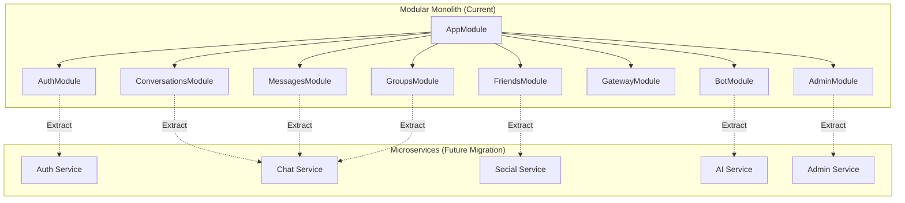

# Architecture Decisions & Technology Choices

> A comprehensive engineering decision document explaining why every major technology and architecture decision was chosen for the ChatApp real-time messaging platform. Written as Architecture Decision Records (ADRs) following Principal Engineer design reasoning.

---

## 1. Architectural Philosophy

### 1.1 Why This Architecture Exists

ChatApp is designed as a production-grade real-time messaging platform that prioritizes:

1. **Developer velocity** — A single developer or small team can understand, modify, and deploy the entire system
2. **Operational simplicity** — The full stack runs via `docker compose up` with no external service dependencies for local development
3. **Real-time by default** — WebSocket events are first-class citizens, not bolted onto a REST API
4. **Privacy-first AI** — Local LLM inference keeps user data within the deployment boundary
5. **Incremental complexity** — Start as a modular monolith, extract microservices only when scale demands it

### 1.2 System Goals

| Goal | Priority | Approach |
|------|----------|----------|
| Reliability | High | Health checks for all services, dead-letter queues with retry, PostgreSQL ACID guarantees |
| Scalability | Medium | Redis adapter for horizontal WebSocket scaling, stateless backend, RabbitMQ for async decoupling |
| Extensibility | High | Modular NestJS architecture, enum-based DI tokens, event-driven communication between modules |
| Operability | High | Docker Compose single-command deployment, Prometheus + Grafana monitoring, structured health endpoint |
| Security | High | JWT dual-token auth, bcrypt password hashing, rate limiting, audit logging, RBAC |

### 1.3 Core Tradeoffs

**Simplicity vs. Scalability**

We chose simplicity. A modular monolith with Docker Compose is easier to develop, test, and deploy than a distributed microservices architecture. The Redis adapter for Socket.IO provides a horizontal scaling escape hatch when needed. We accept that at very large scale (millions of concurrent users), the monolith will need decomposition — but we optimize for the 99% case where it won't.

**Consistency vs. Availability**

We chose consistency. PostgreSQL's ACID guarantees are essential for a messaging system where message ordering, delivery confirmation, and conversation integrity must be reliable. We accept that this means the system cannot be globally distributed with multi-region writes in the current architecture. For single-region deployments, this is the correct tradeoff.

**Performance vs. Maintainability**

We chose maintainability. The two-layer event system (EventEmitter2 → WebSocket Gateway) adds a layer of indirection that could be eliminated by having controllers emit WebSocket events directly. However, this decoupling means business logic controllers don't need to know about WebSocket connections, making the system far easier to test and modify. The performance cost is negligible (in-process event emission adds microseconds).

---

## 2. Monolith vs Modular Monolith vs Microservices

### 2.1 The Decision

ChatApp is implemented as a **modular monolith** — a single deployable unit with strict module boundaries. This was an explicit architectural choice, not an accident of scope.

### 2.2 Comparison

| Factor | Monolith | Modular Monolith (Chosen) | Microservices |
|--------|----------|--------------------------|---------------|
| **Deployment** | Single unit | Single unit | Multiple independent services |
| **Scaling** | Entire app scales together | Entire app scales together | Individual services scale independently |
| **Team structure** | Single team | Small number of teams | Many independent teams |
| **Data consistency** | Simple (single DB) | Simple (single DB, module-scoped) | Complex (distributed transactions, eventual consistency) |
| **Operational complexity** | Low | Low | High (service discovery, circuit breakers, distributed tracing) |
| **Development velocity** | Fast start, slows with size | Fast start, stays manageable with module discipline | Slow start (infrastructure overhead), fast for large teams |
| **Testing** | Simple integration tests | Module-level unit + integration tests | Contract testing, integration testing across services |
| **Fault isolation** | One failure cascades | Module boundaries limit cascade | Failures isolated to individual services |

### 2.3 Why Modular Monolith Was Chosen

**Current reality:**
- The backend has 29 modules in a single NestJS application (`apps/backend/src/app.module.ts`)
- All modules share a single PostgreSQL database
- The team is small — the overhead of microservices (service discovery, distributed tracing, inter-service communication) would consume more engineering time than it saves

**Module boundaries provide the key benefit of microservices without the operational cost:**
- Each module has a well-defined interface (`I<ServiceName>Service`)
- Modules communicate through dependency injection and event emitters, not direct imports
- The `Services` enum provides named DI tokens that could be replaced by remote service calls in a future microservices decomposition
- Module-specific database queries are encapsulated within each module's service

### 2.4 Migration Path to Microservices

When the modular monolith reaches its scaling limits, individual modules can be extracted:

1. **Replace DI tokens with RPC calls** — The `Services` enum tokens can be swapped for gRPC or HTTP client calls without changing consumers
2. **Database per service** — Each extracted service gets its own database, with data synced via events
3. **API gateway** — NGINX routes to different backend services instead of a single backend
4. **Event bus** — Replace in-process EventEmitter2 with RabbitMQ or Kafka for inter-service communication

**What should NOT be prematurely extracted:**
- The auth module (tightly coupled with guards and middleware across all endpoints)
- The gateway module (WebSocket connections should stay centralized for connection management)
- The audit module (should remain a passive consumer, not a service that others depend on)

---

