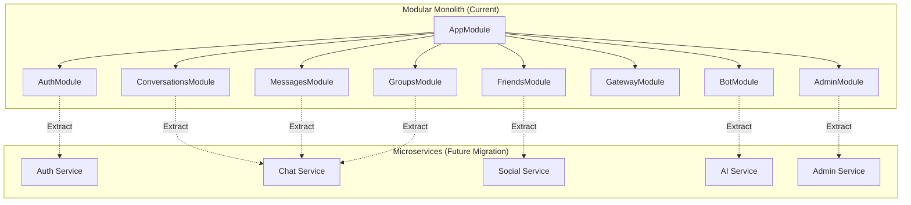
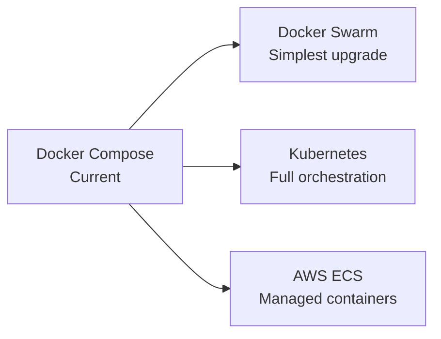

# Architecture Decisions & Technology Choices

> A comprehensive engineering decision document explaining why every major technology and architecture decision was chosen for the ChatApp real-time messaging platform. Written as Architecture Decision Records (ADRs) following Principal Engineer design reasoning.

---

## 1. Architectural Philosophy

### 1.1 Why This Architecture Exists

ChatApp is designed as a production-grade real-time messaging platform that prioritizes:

1. **Developer velocity** — A single developer or small team can understand, modify, and deploy the entire system
2. **Operational simplicity** — The full stack runs via `docker compose up` with no external service dependencies for local development
3. **Real-time by default** — WebSocket events are first-class citizens, not bolted onto a REST API
4. **Privacy-first AI** — Local LLM inference keeps user data within the deployment boundary
5. **Incremental complexity** — Start as a modular monolith, extract microservices only when scale demands it

### 1.2 System Goals

| Goal | Priority | Approach |
|------|----------|----------|
| Reliability | High | Health checks for all services, dead-letter queues with retry, PostgreSQL ACID guarantees |
| Scalability | Medium | Redis adapter for horizontal WebSocket scaling, stateless backend, RabbitMQ for async decoupling |
| Extensibility | High | Modular NestJS architecture, enum-based DI tokens, event-driven communication between modules |
| Operability | High | Docker Compose single-command deployment, Prometheus + Grafana monitoring, structured health endpoint |
| Security | High | JWT dual-token auth, bcrypt password hashing, rate limiting, audit logging, RBAC |

### 1.3 Core Tradeoffs

**Simplicity vs. Scalability**

We chose simplicity. A modular monolith with Docker Compose is easier to develop, test, and deploy than a distributed microservices architecture. The Redis adapter for Socket.IO provides a horizontal scaling escape hatch when needed. We accept that at very large scale (millions of concurrent users), the monolith will need decomposition — but we optimize for the 99% case where it won't.

**Consistency vs. Availability**

We chose consistency. PostgreSQL's ACID guarantees are essential for a messaging system where message ordering, delivery confirmation, and conversation integrity must be reliable. We accept that this means the system cannot be globally distributed with multi-region writes in the current architecture. For single-region deployments, this is the correct tradeoff.

**Performance vs. Maintainability**

We chose maintainability. The two-layer event system (EventEmitter2 → WebSocket Gateway) adds a layer of indirection that could be eliminated by having controllers emit WebSocket events directly. However, this decoupling means business logic controllers don't need to know about WebSocket connections, making the system far easier to test and modify. The performance cost is negligible (in-process event emission adds microseconds).

---

## 2. Monolith vs Modular Monolith vs Microservices

### 2.1 The Decision

ChatApp is implemented as a **modular monolith** — a single deployable unit with strict module boundaries. This was an explicit architectural choice, not an accident of scope.

### 2.2 Comparison

| Factor | Monolith | Modular Monolith (Chosen) | Microservices |
|--------|----------|--------------------------|---------------|
| **Deployment** | Single unit | Single unit | Multiple independent services |
| **Scaling** | Entire app scales together | Entire app scales together | Individual services scale independently |
| **Team structure** | Single team | Small number of teams | Many independent teams |
| **Data consistency** | Simple (single DB) | Simple (single DB, module-scoped) | Complex (distributed transactions, eventual consistency) |
| **Operational complexity** | Low | Low | High (service discovery, circuit breakers, distributed tracing) |
| **Development velocity** | Fast start, slows with size | Fast start, stays manageable with module discipline | Slow start (infrastructure overhead), fast for large teams |
| **Testing** | Simple integration tests | Module-level unit + integration tests | Contract testing, integration testing across services |
| **Fault isolation** | One failure cascades | Module boundaries limit cascade | Failures isolated to individual services |

### 2.3 Why Modular Monolith Was Chosen

**Current reality:**
- The backend has 29 modules in a single NestJS application (`apps/backend/src/app.module.ts`)
- All modules share a single PostgreSQL database
- The team is small — the overhead of microservices (service discovery, distributed tracing, inter-service communication) would consume more engineering time than it saves

**Module boundaries provide the key benefit of microservices without the operational cost:**
- Each module has a well-defined interface (`I<ServiceName>Service`)
- Modules communicate through dependency injection and event emitters, not direct imports
- The `Services` enum provides named DI tokens that could be replaced by remote service calls in a future microservices decomposition
- Module-specific database queries are encapsulated within each module's service

### 2.4 Migration Path to Microservices

When the modular monolith reaches its scaling limits, individual modules can be extracted:

1. **Replace DI tokens with RPC calls** — The `Services` enum tokens can be swapped for gRPC or HTTP client calls without changing consumers
2. **Database per service** — Each extracted service gets its own database, with data synced via events
3. **API gateway** — NGINX routes to different backend services instead of a single backend
4. **Event bus** — Replace in-process EventEmitter2 with RabbitMQ or Kafka for inter-service communication

**What should NOT be prematurely extracted:**
- The auth module (tightly coupled with guards and middleware across all endpoints)
- The gateway module (WebSocket connections should stay centralized for connection management)
- The audit module (should remain a passive consumer, not a service that others depend on)

---

## 3. Why NestJS

### 3.1 The Decision

NestJS was chosen as the backend framework for its opinionated module system, dependency injection, and enterprise-grade patterns that scale from prototype to production.

### 3.2 Key Benefits

| Feature | How ChatApp Uses It |
|---------|-------------------|
| **Dependency Injection** | `Services` enum tokens decouple interfaces from implementations — modules depend on abstractions, not concrete classes |
| **Modularity** | 29 feature modules with clear boundaries, each registered in `AppModule` |
| **Decorators** | `@Inject()`, `@Controller()`, `@UseGuards()`, `@OnEvent()` provide declarative, readable configuration |
| **Type Safety** | Full TypeScript with interface-driven service contracts |
| **EventEmitter2** | In-process event bus for the two-layer real-time architecture |
| **WebSocket Support** | First-class Socket.IO gateway with `@SubscribeMessage` and `@OnEvent` decorators |
| **Guards & Interceptors** | Global `ThrottlerBehindProxyGuard` for rate limiting, `TelemetryInterceptor` for metrics |
| **Swagger** | Auto-generated API documentation via `@nestjs/swagger` decorators |
| **Validation** | Global `ValidationPipe` with `class-validator` DTOs |
| **Testability** | Jest integration with module-level `*.spec.ts` tests |

### 3.3 Comparison with Alternatives

| Framework | Pros | Why Not Chosen |
|-----------|------|---------------|
| **Express** | Minimal, flexible, huge ecosystem | No module system, no DI, no opinionated structure — would require building all patterns from scratch |
| **Fastify** | Fastest Node.js framework | Plugin system is less structured than NestJS modules; would lose the decorator-based DI pattern |
| **Spring Boot (Java)** | Enterprise-grade, mature | JVM overhead, slower startup, heavier Docker images, different language ecosystem |
| **Go Fiber / Gin** | Excellent performance, small binaries | Less mature WebSocket ecosystem, no decorator-based DI, more verbose error handling |
| **ASP.NET Core** | Excellent performance, strong typing | Different language (C#), larger runtime image, Windows-centric developer experience |

### 3.4 Tradeoffs

- **Bun runtime:** Using Bun instead of Node.js for faster startup and install times. All NestJS features are compatible.
- **SWC over tsc:** Using SWC for faster compilation during builds (`swc src --out-dir dist`), as `nest build` (tsc) was too slow for the CI pipeline.
- **No CQRS:** The spec mentions CQRS, but the codebase uses a standard service pattern. Module boundaries provide sufficient separation without the complexity of command/query segregation. CQRS can be introduced per-module when needed.

---

## 4. Why React + Vite

### 4.1 The Decision

React 18 with Vite 6 was chosen for the frontend. Redux Toolkit handles state management. This combination provides developer velocity, a mature ecosystem, and excellent tooling.

### 4.2 Why Vite over Webpack

Vite provides native ESM development, instant hot module replacement, and optimized Rollup-based production builds. Build times dropped from 30+ seconds (webpack/CRACO) to under 5 seconds. The developer experience improvement is significant for a project with 100+ components.

### 4.3 Why Redux Toolkit over Alternatives

| State Manager | Pros | Why Not Primary |
|---------------|------|-----------------|
| **Redux Toolkit** | Predictable, DevTools, `createAsyncThunk` pattern | More boilerplate than Zustand for simple state |
| **Zustand** | Minimal API, small bundle | Insufficient for 14+ interdependent slices with cross-slice communication |
| **React Context** | Built-in, no dependencies | Not suitable for high-frequency updates (message streams, typing indicators) |
| **React Query** | Excellent for server state | Only handles cache/fetch — doesn't manage local UI state (selected conversation, editing state, call state) |

Redux Toolkit was chosen because the application has complex state with many interdependent slices. The `createAsyncThunk` pattern provides a consistent approach for all API interactions, and Redux DevTools enables time-travel debugging for real-time event flows.

### 4.4 Comparison with Alternatives

| Framework | Pros | Why Not Chosen |
|-----------|------|---------------|
| **Next.js** | SSR, routing, API routes | SSR adds complexity without clear benefit for a real-time SPA. WebSocket connections are inherently client-side. ChatApp doesn't need SEO for content pages |
| **Vue 3** | Excellent DX, Composition API | Smaller hiring pool, less ecosystem momentum for complex real-time applications |
| **Angular** | Full framework, strong typing | Heavier bundle, steeper learning curve, more boilerplate for the same functionality |
| **Svelte** | Smallest bundle, reactive by default | Immature ecosystem for complex applications, fewer component libraries |

---

## 5. Why PostgreSQL

### 5.1 The Decision

PostgreSQL 16 is the primary data store, accessed via TypeORM 0.3.x. All entities use UUID primary keys.

### 5.2 Why Relational for Messaging

Messaging systems require strong data consistency:
- **Message ordering** — Messages must appear in chronological order within a conversation. PostgreSQL's `createdAt` timestamps with index-based pagination guarantee this
- **Delivery guarantees** — A message is either fully persisted (all columns, relations, attachments) or not at all. PostgreSQL's ACID transactions ensure atomicity
- **Conversation integrity** — Conversations must have exactly two participants. Foreign key constraints enforce this at the database level
- **Read receipts** — Tracking which messages a user has read requires relational consistency between the message, user, and receipt tables

### 5.3 Feature Usage

| PostgreSQL Feature | ChatApp Usage |
|-------------------|---------------|
| **ACID transactions** | Message creation + attachment linking in a single transaction |
| **UUID primary keys** | All entities use UUIDs for globally unique identification |
| **Full-text search** | `tsvector`/`tsquery` with GIN index for message, user, and group search |
| **JSONB** | Audit log `metadata` field stores arbitrary context without schema migration |
| **Foreign keys** | Enforce referential integrity between users, conversations, messages, groups |
| **Indexes** | GIN index for search, B-tree indexes on `userId`, `conversationId`, `createdAt` |

### 5.4 Comparison with Alternatives

| Database | Pros | Why Not Chosen |
|----------|------|---------------|
| **MongoDB** | Flexible schema, horizontal scaling | No ACID transactions (historically), no full-text search quality, no referential integrity enforcement |
| **Cassandra** | Write-optimized, multi-region | No secondary indexes, no joins, eventual consistency — wrong tradeoff for messaging |
| **MySQL** | Widely deployed, mature | PostgreSQL has better full-text search, JSONB support, and extension ecosystem |
| **DynamoDB** | Fully managed, unlimited scale | Vendor lock-in, no joins, no full-text search, expensive for read-heavy messaging workloads |

---

## 6. Why Redis

### 6.1 The Decision

Redis 7 serves three distinct purposes in the architecture: caching, token blacklisting, and WebSocket pub/sub.

### 6.2 Three Use Cases

| Use Case | Implementation | Key Details |
|----------|---------------|-------------|
| **Caching** | `RedisCacheService` with generic `get`/`set`/`del`/`invalidatePattern` | Default TTL: 5 minutes. Caches user profiles, conversation lists, friend lists. Pattern-based invalidation on writes |
| **Token Blacklisting** | `RedisService` stores invalidated JWTs | TTL matches token's remaining lifetime. Auth guard checks blacklist before accepting tokens |
| **WebSocket Pub/Sub** | `@socket.io/redis-adapter` | Two Redis clients (pub/sub) synchronize WebSocket events across multiple backend instances. Falls back to in-memory if Redis is unavailable |

### 6.3 Why Redis Over Alternatives

| Alternative | Why Not |
|-------------|---------|
| **Memcached** | No pub/sub, no data structures (only key-value), no persistence options |
| **NATS** | Message broker, not a cache — would need a separate caching solution |
| **Hazelcast** | Java-centric, heavier, overkill for the current scale |

### 6.4 Limitations and Mitigations

| Limitation | Mitigation |
|-----------|-----------|
| **Memory pressure** | Set `maxmemory` with `allkeys-lru` eviction policy. Monitor memory usage via Prometheus |
| **Persistence tradeoffs** | Cache data is reproducible from PostgreSQL. Token blacklist entries have short TTLs. Acceptable to lose on restart |
| **Event loss risk** | WebSocket events are fire-and-forget indicators. Critical data (messages) is persisted in PostgreSQL before Redis pub/sub delivers events |

---

## 7. Why BullMQ vs RabbitMQ vs Kafka

### 7.1 The Decision

RabbitMQ 3 is used for async message processing with dead-letter exchanges and retry logic.

### 7.2 Why RabbitMQ

| Factor | BullMQ (Redis) | RabbitMQ (Chosen) | Kafka |
|--------|----------------|-------------------|-------|
| **Setup complexity** | Zero (uses existing Redis) | Medium (separate service) | High (Zookeeper/KRaft + brokers) |
| **Delivery guarantees** | At-least-once | At-least-once with DLX | Exactly-once (with transactions) |
| **Message ordering** | Per-queue | Per-queue | Per-partition |
| **Throughput** | ~10K msg/s | ~50K msg/s | ~1M msg/s |
| **Operational complexity** | Low | Medium | High |
| **Replayability** | Not supported | Requeue from DLQ | Topic retention + replay |
| **Consumer groups** | Yes | Via prefetch + multiple consumers | Native |
| **Management UI** | None (Redis CLI) | Built-in (:15672) | Third-party (Confluent Control Center) |

RabbitMQ was chosen because:
1. **Dead-letter exchanges** provide reliable retry with exponential backoff — critical for async operations like file processing and notifications
2. **Management UI** gives operational visibility into queue depths, consumer status, and message rates
3. **Protocol flexibility** — AMQP supports complex routing patterns (fanout, topic, header-based) that may be needed as the system grows
4. **Not Kafka** — Kafka is designed for high-throughput event streaming. ChatApp's queue usage is for async task processing (file uploads, notifications, audit logs), not event sourcing. Kafka's operational overhead is not justified at this scale.

### 7.3 Queue Architecture

Each queue has a **dead-letter exchange (DLX)** and `.dlq` dead letter queue:
- Messages are retried up to **3 times** before routing to the DLQ
- **Exponential backoff** on reconnection (up to 10 retries, max 30s delay)
- **Prefetch:** 10 messages per consumer for fair dispatch

**Queue processors:**

| Processor | Queue | Purpose |
|-----------|-------|---------|
| `FileUploadProcessor` | `file-upload` | Thumbnail generation, metadata extraction |
| `NotificationProcessor` | `notification` | Push/email/in-app notification delivery |
| `AuditProcessor` | `audit` | Immutable audit log recording |

### 7.4 When Kafka Becomes Necessary

Kafka should be considered when:
- Event sourcing is adopted (replaying events to rebuild state)
- Multi-service event broadcasting is needed (consumer groups across services)
- Throughput exceeds what RabbitMQ can handle (>100K messages/second)
- Long-term event retention is required (days/weeks of replay history)

---

## 8. Why WebSockets + Redis Adapter

### 8.1 The Decision

Socket.IO with the `@socket.io/redis-adapter` is used for real-time communication. This combination provides reliable WebSocket connections with automatic fallback to HTTP long-polling and multi-instance synchronization via Redis pub/sub.

### 8.2 Why Socket.IO over Native WebSocket

| Feature | Socket.IO | Native WebSocket |
|---------|-----------|-----------------|
| Auto-reconnection | Built-in with exponential backoff | Must implement manually |
| Fallback transport | HTTP long-polling automatically | None — connection fails if WebSocket is blocked |
| Room abstraction | `socket.join(room)`, `server.to(room).emit()` | Must implement room management manually |
| Acknowledgments | Callback-based ack system | Must implement manually |
| Namespaces | Logical separation of event streams | Not supported |
| Binary support | Automatic | Manual frame handling |
| Authentication | `auth` object in handshake | Must implement |

Socket.IO was chosen because it solves the hard problems of WebSocket communication (reconnection, rooms, fallback transport) out of the box. For a messaging application where reliability matters more than minimal protocol overhead, this is the correct tradeoff.

### 8.3 Redis Adapter for Multi-Instance Scaling

When running multiple backend instances behind a load balancer, Socket.IO events emitted by one instance need to reach clients connected to other instances. The Redis adapter solves this by using Redis pub/sub channels:

1. Instance A emits an event to a room
2. The Redis adapter publishes the event to a Redis channel
3. All other instances subscribed to that channel receive the event
4. Each instance delivers the event to its locally connected clients in that room

**Fallback:** If Redis is unavailable, the adapter falls back to in-memory mode. Events only reach clients connected to the same instance. This is logged as a warning.

### 8.4 Sticky Sessions

The NGINX configuration does not currently implement sticky sessions. With the Redis adapter, sticky sessions are **not required** — events are broadcast across all instances via Redis. However, sticky sessions can improve performance by reducing Redis pub/sub traffic for the common case where a client's events only need to reach clients on the same instance.

---

## 9. Why S3/MinIO

### 9.1 The Decision

MinIO is used as an S3-compatible object storage service for file attachments, avatars, and banners. It runs as a Docker container with persistent volumes.

### 9.2 Why S3-Compatible Storage

| Storage Type | Pros | Why Not |
|-------------|------|---------|
| **S3-compatible (MinIO)** | Presigned URLs for direct upload, CDN-ready, lifecycle policies, horizontal scaling | Requires a separate service |
| **Local filesystem** | Simplest option | Not stateless — breaks with multiple backend instances. No CDN integration. No lifecycle management |
| **NFS** | Shared filesystem | No presigned URLs, no CDN integration, single point of failure |
| **Database BLOB** | Transactional with message | Bloats the database, poor performance for large files, no CDN |

### 9.3 Key Design Decisions

- **Presigned URLs** — Clients upload directly to MinIO, bypassing the backend. This reduces backend load and improves upload speed
- **Three buckets** — `chatapp-uploads` (general), `chatapp-avatars` (profile images), `chatapp-attachments` (message files) — for lifecycle policy separation
- **Sharp thumbnail generation** — Images get a 300px JPEG thumbnail via the `FileUploadProcessor` (RabbitMQ consumer) for fast preview loading
- **10 MB file size limit** — Enforced at the application level via `ValidationPipe` DTOs

### 9.4 Production Migration Path

MinIO is development-friendly (runs locally, no AWS account needed). For production, replace with:
- **AWS S3** — Managed durability (99.999999999%), availability, and CDN integration (CloudFront)
- **GCS** — Google's equivalent with similar guarantees
- **MinIO distributed mode** — Self-hosted with erasure coding for durability

The S3-compatible API means the application code doesn't change — only the endpoint and credentials.

---

## 10. Why OpenTelemetry + Grafana + Loki + Prometheus

### 10.1 The Decision

The observability stack uses Prometheus for metrics, Grafana for dashboards, Loki for log aggregation, and Promtail for log shipping. The backend implements a custom Prometheus-format metrics exporter rather than using the OpenTelemetry SDK.

### 10.2 Current Implementation

The `TelemetryService` is a custom Prometheus-format exporter that maintains in-memory counters, gauges, and histograms:

- `http_requests_total` — Counter with `method`, `route`, `status_code` labels
- `http_request_duration_seconds` — Histogram with the same labels and standard Prometheus buckets

The `TelemetryInterceptor` (global NestJS interceptor) records request duration and increments counters.

**Why custom instead of OpenTelemetry SDK:**
- Lower dependency footprint (no OTel SDK, no OTel collector)
- Direct control over metric naming and labeling conventions
- Sufficient for the current scale — a single backend instance with moderate traffic
- OpenTelemetry SDK can be introduced later when distributed tracing is needed across multiple services

### 10.3 When to Adopt OpenTelemetry SDK

Migrate to the OpenTelemetry SDK when:
- Multiple backend services need distributed tracing
- Trace correlation across service boundaries is required
- The team wants auto-instrumented HTTP/database/span metrics
- Jaeger or Zipkin is deployed for trace visualization

### 10.4 Why This Stack

| Component | Purpose | Why Chosen |
|-----------|---------|-----------|
| **Prometheus** | Metrics storage and querying | Industry standard, pull-based model fits container networking, powerful PromQL |
| **Grafana** | Dashboards and alerting | Best-in-class visualization, supports both Prometheus and Loki as data sources |
| **Loki** | Log aggregation | Logql is powerful, doesn't index log content (cheaper than ELK), integrates natively with Grafana |
| **Promtail** | Log shipping | Designed for Loki, Docker-aware labeling, minimal configuration |

---

## 11. Why Docker Compose Initially

### 11.1 The Decision

Docker Compose is the primary deployment mechanism for development and initial production deployment.

### 11.2 Why Docker Compose

- **Single command onboarding** — `docker compose up` starts the entire stack. No manual service configuration needed
- **Environment parity** — Developers run the same containers that will be deployed, eliminating "works on my machine" issues
- **Service dependencies** — `depends_on` with health checks ensures services start in the correct order
- **Volume management** — Persistent data (PostgreSQL, MinIO, Redis) survives container restarts
- **Networking** — Docker network provides service discovery via container names (e.g., `postgres`, `redis`)

### 11.3 Limitations

| Limitation | Impact | Mitigation |
|-----------|--------|-----------|
| Single host only | Cannot distribute services across multiple machines | Accept for dev/small production; migrate to Kubernetes for multi-host |
| No built-in secret management | `.env.docker` with plaintext secrets | Use Docker secrets or external secrets manager for production |
| No auto-scaling | Manual capacity planning | Kubernetes Horizontal Pod Autoscaler for production |
| No rolling updates | Downtime during deployments | Use blue/green deployment with two compose stacks |

### 11.4 Migration Path

- **Docker Swarm** — Easiest migration; same compose files, adds multi-host and rolling updates
- **Kubernetes** — Full orchestration with auto-scaling, self-healing, and ecosystem (Helm, Istio)
- **AWS ECS / Google Cloud Run** — Managed container services with less operational overhead

---

## 12. Why AI Integration Architecture

### 12.1 The Decision

Ollama is used for local LLM inference, providing AI chatbot capabilities without sending user data to external services.

### 12.2 Why Local LLM (Ollama)

| Factor | Ollama (Local) | OpenAI API | OpenRouter |
|--------|---------------|------------|------------|
| **Privacy** | Complete — data never leaves Docker network | User data sent to OpenAI | User data sent to third parties |
| **Cost** | Free (hardware costs only) | $0.01-0.06 per 1K tokens | Varies by model |
| **Offline** | Works without internet | Requires internet | Requires internet |
| **Quality** | Depends on model (7B-70B params) | GPT-4 class | Multiple models available |
| **Latency** | 1-30s (hardware dependent) | 0.5-3s | 1-5s |
| **Setup** | Docker container + model pull | API key | API key |

Ollama was chosen because:
1. **Privacy is paramount** — ChatApp messages are sensitive. Sending them to third-party AI services violates the platform's privacy-first philosophy
2. **Zero marginal cost** — No per-token charges. Users can interact with AI bots without usage limits
3. **Offline capability** — The entire platform works without internet connectivity (within the Docker network)
4. **Model flexibility** — Any GGUF-quantized model can be loaded via Ollama

### 12.3 Streaming Architecture

AI responses stream token-by-token via WebSocket:
1. User sends a message via `POST /api/bots/:id/chat`
2. Backend loads conversation history and sends to Ollama's streaming chat API
3. Each token chunk is emitted as `onAIStreamChunk` via WebSocket
4. On completion, the full response is persisted to PostgreSQL and `onAIStreamEnd` is emitted

This provides immediate feedback — the user sees the AI "typing" in real-time, similar to ChatGPT's streaming behavior.

### 12.4 Tradeoffs

- **Quality vs. Privacy:** Local 7B-parameter models produce lower-quality responses than GPT-4. This is acceptable for a general-purpose assistant but may not satisfy specialized use cases
- **Latency vs. Cost:** Without a GPU, inference is slow. GPU passthrough in Docker significantly improves performance
- **Context limits:** The current implementation loads full conversation history, which may exceed model context windows for long conversations. Sliding window or summary-based context compression is needed

---

