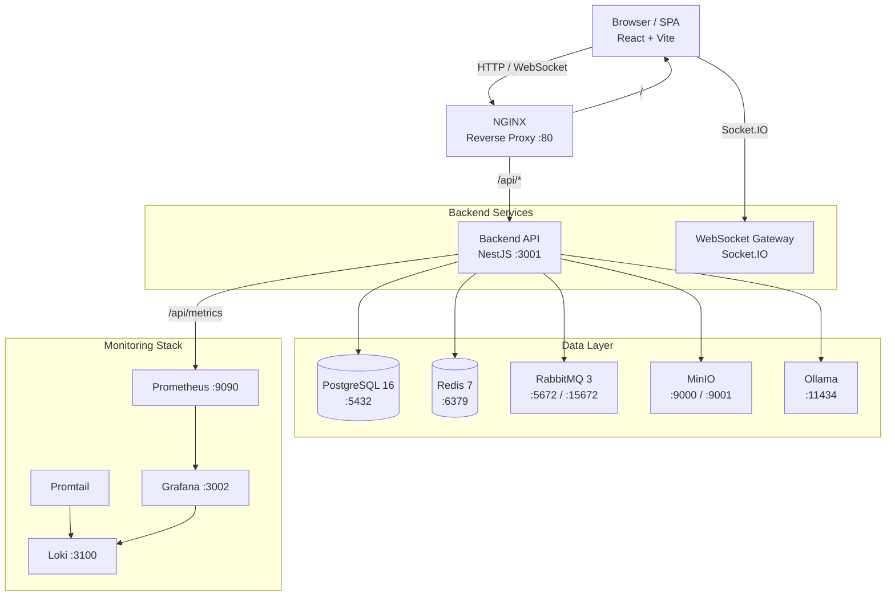
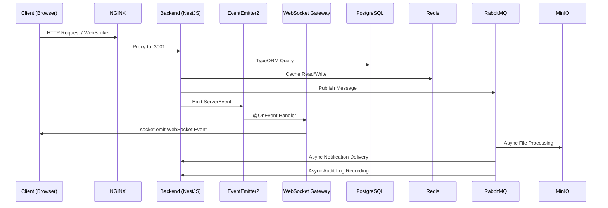
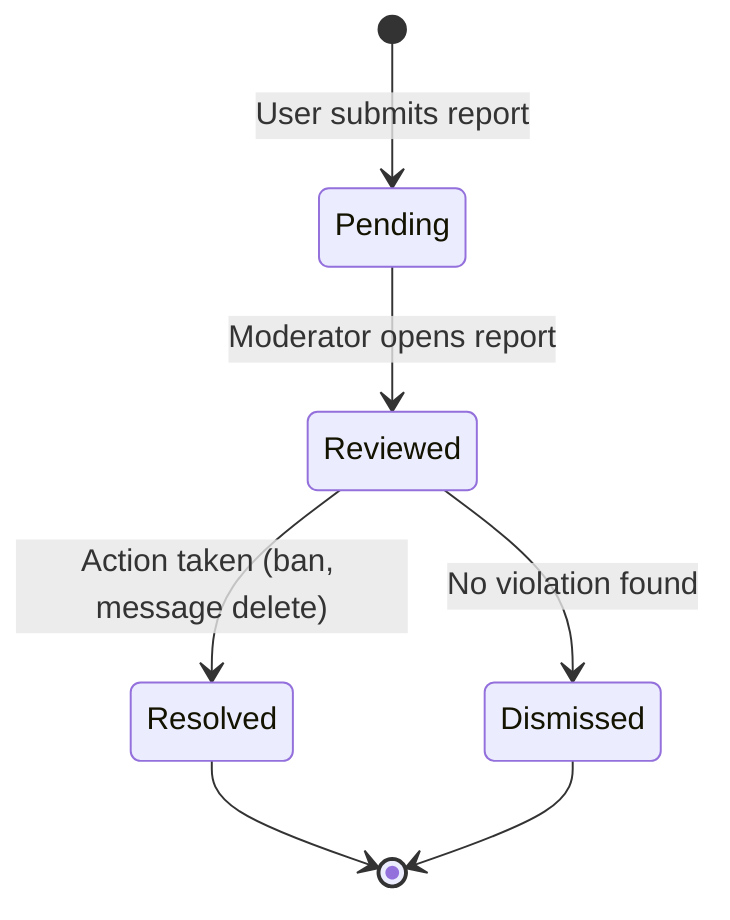

# User & Developer Guide

> Comprehensive documentation for the ChatApp real-time messaging platform — covering end-user workflows, administrator operations, developer onboarding, and operational best practices.

---

## 1. Platform Overview

### 1.1 What Is ChatApp?

ChatApp is a full-stack, real-time messaging platform designed to support direct messaging, group conversations, voice and video calls, AI-powered chat assistants, and enterprise-grade administration. It draws architectural inspiration from platforms like Discord, Slack, and Microsoft Teams while remaining deployable as a self-hosted, Docker Compose-managed system.

The platform is built as a **monorepo** containing a NestJS backend, a React/Vite frontend, and all supporting infrastructure definitions. Every service runs inside Docker containers, making the entire stack reproducible from a single `docker compose up`.

### 1.2 Core Architecture

ChatApp follows a **modular monolith** architecture on the backend with a decoupled two-layer event system for real-time communication. The frontend is a single-page application (SPA) built with React, using Redux Toolkit for state management and Socket.IO for WebSocket connectivity.

#### System Architecture



#### Service Communication



### 1.3 High-Level Components

| Component | Technology | Port | Purpose |
|-----------|-----------|------|---------|
| Reverse Proxy | NGINX (Alpine) | 80 | Routes `/api/*` to backend, serves frontend SPA, proxies WebSocket connections |
| Backend API | NestJS + TypeScript (Bun runtime) | 3001 | REST API, WebSocket gateway, business logic, authentication |
| Frontend SPA | React 18 + Vite + TypeScript | 80/3000 | User interface, real-time updates via Socket.IO |
| Database | PostgreSQL 16 | 5432 | Primary data store — users, messages, conversations, groups, audit logs |
| Cache & Pub/Sub | Redis 7 | 6379 | Session caching, JWT token blacklisting, WebSocket pub/sub for multi-instance scaling |
| Message Queue | RabbitMQ 3 (Management) | 5672/15672 | Async processing — file uploads, notifications, audit logging with DLX retry |
| Object Storage | MinIO (S3-compatible) | 9000/9001 | File attachments, avatars, banners — presigned URL uploads, Sharp thumbnail generation |
| AI Inference | Ollama | 11434 | Local LLM serving for AI chatbot — streaming token-by-token responses |
| Metrics | Prometheus | 9090 | Scrapes backend `/api/metrics` every 15s, stores time-series data |
| Dashboards | Grafana | 3002 | Pre-built dashboards for CPU, memory, request rate, latency |
| Log Aggregation | Loki + Promtail | 3100 | Centralized log collection, querying via Grafana Explore |

### 1.4 Supported Features

#### Messaging & Communication
- **Direct Messages** — One-to-one conversations with cursor-based pagination, message edit/delete, typing indicators, and read receipts
- **Group Chats** — Multi-user conversations with owner/member roles, member management, ownership transfer, and group-level message threading
- **Threads** — Reply to specific messages within a conversation; single nesting depth with paginated thread retrieval
- **Emoji Reactions** — Add/remove emoji reactions on any message (up to 20 per message)
- **File Attachments** — Upload images, documents, and media via MinIO presigned URLs; automatic Sharp thumbnail generation (300px)
- **Search** — Full-text search across messages, users, and groups using PostgreSQL `tsvector`/`tsquery` with GIN index and relevance ranking

#### Real-Time Capabilities
- **WebSocket Events** — All message delivery, typing indicators, read receipts, presence updates, and reactions pushed in real-time via Socket.IO
- **Presence** — Online/offline/away status with custom status messages, "appear offline" mode, and grace period for reconnections
- **Typing Indicators** — Real-time typing state per conversation and group
- **Read Receipts** — Single/double checkmark delivery/read status; batch updates at 1-second intervals; can be disabled per-user
- **Notifications** — Real-time + REST notifications for messages, friend requests, group invites, reactions, mentions, and thread replies; 90-day auto-deletion

#### Voice & Video
- **WebRTC Calls** — Peer-to-peer voice and video calls via PeerJS with STUN/TURN server configuration, mute/camera/screen-share controls, and 30-second call timeout

#### Social
- **Friends** — Send/accept/reject/cancel friend requests; friend list management; real-time friend request notifications; limits of 1000 friends and 50 pending requests
- **User Profiles** — Avatar and banner uploads (MinIO), custom about text, username changes with availability checking, onboarding flow for new users

#### AI Assistant
- **AI Chatbot** — Ollama-powered conversational AI with configurable personas and models; streaming token-by-token responses via WebSocket; per-user private conversation history; admin-managed bot CRUD

#### Administration
- **Role-Based Access** — Three-tier role system: USER, MODERATOR, ADMIN with guarded endpoints
- **User Management** — List users, ban/unban accounts, change roles
- **Content Moderation** — Message deletion, report submission and review workflow
- **Audit Logging** — Immutable audit trail with userId, action, entity, metadata, IP address, and timestamp; filterable via API

### 1.5 Scalability Expectations

The architecture supports both single-instance deployment and horizontal scaling:

- **Single instance** — All services in one Docker Compose stack; suitable for teams of up to several hundred concurrent users
- **Multi-instance** — The Redis adapter for Socket.IO enables multiple backend containers behind a load balancer; RabbitMQ consumers can scale independently; MinIO supports distributed mode
- **Database** — PostgreSQL can be promoted to a managed service (RDS, Cloud SQL) or run with read replicas for read-heavy workloads
- **Kubernetes-ready** — All services are containerized with health checks, making migration to Kubernetes straightforward (see [Section 10: DevOps & Deployment Guide](#10-devops--deployment-guide))

### 1.6 Enterprise Goals

ChatApp is designed to meet the following enterprise requirements:

| Goal | Implementation |
|------|---------------|
| **Security** | JWT dual-token auth (15min access + 7d refresh), HTTP-only refresh cookie, bcrypt password hashing, token blacklisting on logout, rate limiting |
| **Observability** | Prometheus metrics, Grafana dashboards, Loki log aggregation, structured health endpoint, correlation-ready request logging |
| **Compliance** | Audit logging for all admin actions, IP address tracking, data retention policies (90-day notification auto-deletion) |
| **Reliability** | Docker health checks for all services, RabbitMQ dead-letter queues with retry, exponential backoff on connection failures |
| **Maintainability** | Modular monolith with clear module boundaries, string-token DI, enum-based constants, consistent code patterns across all 29 backend modules |
| **Extensibility** | Feature-based module architecture, event-driven decoupling, pluggable AI backend (Ollama), S3-compatible storage abstraction |

---

## 2. End User Guide

This section provides a complete walkthrough for end users of the ChatApp platform. It covers every user-facing feature from registration through day-to-day messaging, real-time collaboration, notifications, and AI assistant interactions.

### 2.1 Authentication

#### Registration

1. Navigate to the registration page from the login screen
2. Enter a **username** (3-30 characters, must be unique)
3. Enter a valid **email address**
4. Create a **password** (minimum 8 characters)
5. Click **Sign Up**
6. Upon success, you are automatically authenticated and redirected to the chat interface
7. An onboarding flow prompts you to set an about message (required) and optionally upload an avatar and banner image

**Error handling:**
- Duplicate username or email returns a 409 Conflict error with a descriptive message
- Invalid input (short password, malformed email) returns 400 Bad Request with specific field errors
- All errors are displayed inline next to the relevant form field

#### Login

1. Enter your **email address** and **password**
2. Click **Log In**
3. Upon success, you receive an access token (valid for 15 minutes) and a refresh token (valid for 7 days, stored as an HTTP-only cookie)

**Error handling:**
- Incorrect credentials return 401 Unauthorized
- Account locked or banned returns a specific error message preventing login
- The frontend automatically retries login on network failure after a brief delay

#### Staying Logged In

The platform uses a dual-token JWT strategy:

| Token | Lifetime | Storage | Purpose |
|-------|----------|---------|---------|
| Access Token | 15 minutes | Memory (Redux store) | Authenticates API requests and WebSocket connections |
| Refresh Token | 7 days | HTTP-only cookie | Automatically exchanged for a new token pair |

The frontend's Axios interceptor automatically detects 401 responses and attempts a silent token refresh using the refresh token. If the refresh succeeds, the original request is retried transparently. If the refresh fails (refresh token expired), the user is redirected to the login page.

**Session longevity:** Staying active at least once every 7 days keeps the session alive indefinitely.

#### Logout

1. Click your **profile avatar** (top-right corner)
2. Select **Log Out**
3. The session is terminated: the access token is blacklisted in Redis, and the refresh token cookie is cleared
4. All open browser tabs are notified and redirect to the login page

#### Password Reset (Future)

Password reset via email is planned but not yet implemented. Currently, administrators can reset passwords through the admin panel.

#### Session Management

- Active sessions are tied to the JWT token pair. Each login creates a new refresh token.
- Logging out invalidates the current refresh token. Other active sessions remain valid until their own tokens expire.
- The platform does not currently expose a "manage active sessions" UI. This is planned for a future release.

### 2.2 Messaging

#### Direct Messages

##### Starting a Conversation

1. Click the **New Message** button in the sidebar
2. Search for a user by username in the search field
3. Select the user from the results
4. Type your message in the input field at the bottom
5. Press **Enter** to send (or **Shift+Enter** for a new line)

If a conversation already exists between you and the selected user, it is opened instead of creating a duplicate.

##### Viewing Conversations

- Conversations are listed in the **left sidebar**, ordered by most recent message
- Each conversation shows the other user's avatar, name, a preview of the last message, and a timestamp
- An **unread badge** displays the count of unread messages
- Clicking a conversation loads the message history with cursor-based pagination (50 messages per page, scrolling up loads more)

##### Sending Messages

- Select a conversation, type in the input field, and press **Enter**
- Messages support up to **4000 characters**
- Messages are delivered in real-time to the recipient via WebSocket (`onMessage` event)
- If the recipient is offline, the message is stored in PostgreSQL and delivered when they reconnect

##### Editing Messages

1. Hover over your message
2. Click the **three-dot menu** that appears
3. Select **Edit**
4. Modify the message content
5. Press **Enter** to save

Edited messages display an **(edited)** indicator visible to all participants. The edit is broadcast to other participants via the `onMessageUpdate` WebSocket event.

##### Deleting Messages

1. Hover over your message
2. Click the **three-dot menu**
3. Select **Delete**
4. Confirm the deletion in the dialog

Deleted messages are removed for **all participants** (not just the sender). Deletion is broadcast via the `onMessageDelete` WebSocket event.

#### Group Chats

##### Creating a Group

1. Click the **New Group** button in the sidebar
2. Enter a **group name** (1-100 characters)
3. Optionally add a **description** (up to 500 characters)
4. Add members by searching and selecting users
5. Click **Create Group**

The creator becomes the **group owner** with administrative privileges.

##### Group Messaging

- Messages work identically to direct messages but are broadcast to **all group members**
- Typing indicators show which member is currently typing
- Group messages support all the same features: editing, deletion, reactions, threads, file attachments

##### Managing Group Members (Owner)

- **Add members:** Open the group info panel, click **Add Member**, search and select a user
- **Remove members:** Click the **X** button next to a member's name in the group info panel
- **Leave group:** Any member (including the owner) can leave via the group info panel
- **Transfer ownership:** In the group info panel, click **Transfer Ownership** next to a member. The previous owner becomes a regular member. This action is irreversible.

**Limits:** Maximum of 256 members per group.

#### Message Threads

##### Replying to a Message

1. Hover over any message
2. Click the **Reply** icon
3. A reply input appears with the original message quoted above it
4. Type your reply and press **Enter**

##### Viewing Threads

- Messages with replies display a thread indicator (e.g., "3 replies") below the message
- Click the indicator to open the **thread panel** on the right side of the screen
- Thread replies are loaded chronologically with pagination (50 per page)
- Close the thread panel with the **X** button

**Limitation:** Threads support only single-depth nesting — you cannot reply to a reply.

#### Emoji Reactions

- **Add a reaction:** Hover over a message, click the **smiley face icon**, and select an emoji from the picker
- **Quick react:** Double-click (or double-tap) a message for a quick thumbs-up reaction
- **View reactions:** Emoji badges appear below the message with a count. Hover over a badge to see who reacted
- **Remove your reaction:** Click the highlighted reaction badge beneath the message
- **Limits:** Up to 20 unique reactions per message. Each user can only add one reaction per emoji

Reactions are delivered in real-time via `onReactionAdd` and `onReactionRemove` WebSocket events.

#### Searching Messages, Users, and Groups

1. Click the **search icon** in the top navigation
2. Type a query (minimum 2 characters)
3. Results appear across three tabs:
   - **Messages** — Full-text search with highlighted matching text, ranked by relevance. Click a result to jump to the message in context
   - **People** — Username search with avatar and online status. Click to view profile or start a conversation
   - **Groups** — Group name search with member counts. Click to open the group
4. Scroll to the bottom of results to load more (pagination)
5. Results are access-controlled: you only see messages from your own conversations and groups, and only groups you belong to

#### File Attachments

##### Uploading Files

1. Click the **paperclip icon** in the message input area
2. Select a file from your device (maximum 10 MB)
3. The file is uploaded to MinIO storage via a presigned URL
4. For images, an automatic thumbnail (300px JPEG) is generated by Sharp
5. The attachment appears inline in the conversation with a download link

**Supported file types:**

| Category | Formats |
|----------|---------|
| Images | JPEG, PNG, GIF, WebP, SVG |
| Documents | PDF, plain text, JSON |
| Video | MP4 |
| Audio | MPEG, OGG, WebM |

##### Viewing and Downloading Attachments

- **Images** display inline with thumbnail previews. Click for full-size view
- **Other files** appear as download links with file name and size
- **Download** by clicking the attachment; a fresh presigned URL is generated with 1-hour expiry
- When async processing completes (thumbnails, metadata), an `onAttachmentProcessed` WebSocket event updates the UI

### 2.3 Real-Time Features

#### Presence Indicators

User presence is shown throughout the interface:

| Indicator | Meaning |
|-----------|---------|
| Green dot | Online — active WebSocket connection |
| Yellow dot | Away — no activity for 5 minutes |
| Gray dot | Offline or "Appear Offline" mode enabled |
| Custom text | Status message displayed below the username |

**Setting your presence:**
- Click your **avatar** in the bottom-left sidebar
- Select **Set Status** and type a message (up to 100 characters)
- Toggle **Appear Offline** to hide your online status from other users

Presence updates are synchronized across all connected clients in real-time via the `onPresenceUpdate` WebSocket event. Online friends are visible in the friends list, and online group members appear in the group sidebar.

#### Typing Indicators

When someone is composing a message in a conversation or group you have open, you see **"User is typing..."** below the message input area. This indicator:
- Appears within milliseconds of the other user starting to type
- Disappears when they stop typing or send the message
- Works in both direct messages and group chats
- Uses `typingStart`/`typingStop` events for conversations and `groupTypingStart`/`groupTypingStop` for groups

#### Delivery Status and Read Receipts

Message status is indicated by checkmarks:

| Checkmark | Meaning |
|-----------|---------|
| Single gray checkmark | Message delivered to the server |
| Double gray checkmarks | Message delivered to the recipient's device |
| Double colored checkmarks | Message read by the recipient |

**Behavior:**
- Messages are automatically marked as read when you open a conversation
- Read receipt updates are batched at 1-second intervals to reduce network overhead
- You can disable sending read receipts in **Settings > Privacy** — when disabled, others will not see the colored double checkmarks for your messages

**Disabling read receipts:** If you toggle off "Send Read Receipts," the server stops emitting `onMessageRead` events for your reads. Other users will only see the gray double checkmarks (delivered status).

#### Reconnection Handling

If your network connection drops:

1. Socket.IO automatically attempts to reconnect with exponential backoff
2. While disconnected, a connection status indicator appears in the UI
3. Upon reconnection, the client fetches missed messages via REST API (conversation messages endpoint with cursor-based pagination)
4. Presence status shows a grace period — you are not immediately marked offline during brief disconnects
5. The WebSocket handshake re-authenticates using your current access token

#### Voice and Video Calls

##### Initiating a Call

1. Open a direct message conversation with the user you want to call
2. Click the **Phone icon** (voice call) or **Video Camera icon** (video call) in the conversation header
3. The other user receives a ringing notification with your name and avatar

##### Receiving a Call

- A call overlay appears with the caller's name and avatar
- Click the **green phone icon** to accept or the **red phone icon** to decline
- If unanswered within 30 seconds, the call automatically times out

##### During a Call

The call interface provides the following controls:
- **Mute/Unmute** — Toggle microphone
- **Camera On/Off** — Toggle video camera
- **Screen Share** — Share your screen with the other participant
- **Hang Up** — End the call

**Technical details:**
- Calls use **WebRTC** via PeerJS for peer-to-peer media streaming
- Signaling (call initiation, acceptance, hangup) is relayed through the WebSocket gateway
- STUN servers assist with NAT traversal; TURN servers can be configured for restrictive networks
- Quality adapts automatically to network conditions, degrading to audio-only on poor connections

### 2.4 Notifications

#### Notification Types

| Type | Icon | Trigger | Data |
|------|------|---------|------|
| New Message | Chat bubble | Message in inactive conversation | conversationId, senderId |
| Friend Request | User+ | Someone sends you a friend request | requestorId |
| Group Invite | Users | Added to a group | groupId, addedByUserId |
| Reaction | Emoji | Someone reacts to your message | messageId, emoji, userId |
| Mention | @ symbol | Someone mentions you (future) | messageId, conversationId |
| Thread Reply | Reply arrow | Someone replies to your message or a thread you follow | messageId, parentMessageId |

#### Viewing Notifications

- Click the **bell icon** in the top navigation bar
- A dropdown displays recent notifications with:
  - Category icon and color
  - Title (e.g., "John sent you a friend request")
  - Timestamp
  - Unread notifications are highlighted; a badge count appears on the bell icon
- Clicking a notification navigates to the relevant context (opens the conversation, shows the message, etc.)
- Friend request notifications include inline **Accept** and **Reject** buttons

#### Managing Notifications

- **Mark as read:** Clicking a notification automatically marks it as read. Use **Mark All as Read** at the top of the panel
- **Sounds:** A short notification sound plays for new notifications. Toggle in **Settings > Notifications > Notification Sounds**
- **Auto-deletion:** Notifications older than 90 days are automatically deleted by the system

### 2.5 AI Assistant Usage

ChatApp includes AI-powered chatbots that run locally via Ollama, providing private, on-device AI conversations.

#### Starting an AI Conversation

1. Look for bots in the **conversation sidebar** — they appear with a **robot icon**
2. Click a bot to start a new conversation, or continue an existing one
3. Type your message and press **Enter**
4. The bot responds with **streaming output** — characters appear one at a time, simulating real-time typing

#### AI Features

- **Multiple bots:** Different bots have different personas and capabilities (e.g., a general assistant, a code helper, a creative writer)
- **Streaming responses:** Tokens are delivered in real-time via `onAIStreamChunk` events, providing immediate feedback
- **Conversation history:** Each bot maintains a separate, private conversation history per user — only you can see your AI conversations
- **Persistent conversations:** Leave and return to bot conversations at any time; history is preserved in PostgreSQL

#### AI Limitations

- **Availability:** AI features require the Ollama service to be running. If Ollama is unavailable, sending a message to a bot returns a 503 Service Unavailable error
- **Model quality:** Response quality depends on the configured Ollama model. Smaller models are faster but less capable
- **Latency:** First response after model loading may take several seconds. Subsequent responses are faster
- **No internet required:** Since Ollama runs locally, AI conversations work completely offline (within the Docker network)

### 2.6 Friends

#### Adding Friends

1. Click the **Add Friend** button in the friends panel
2. Search by username
3. Click **Send Friend Request**

The other user receives a real-time notification and can accept or reject the request.

#### Managing Friend Requests

- **Incoming requests:** Appear in the **Friends tab > Pending Requests** section with Accept/Reject buttons
- **Outgoing requests:** Visible in **Friends tab > Sent Requests** with a Cancel option
- Accepted requests immediately add both users to each other's friends list

**Limits:** Maximum 1000 friends per user, 50 pending friend requests at a time. Requests expire after 30 days if not acted upon.

#### Using the Friends List

- Friends are displayed alphabetically with **online indicators** (green/yellow/gray dots)
- Click a friend to open a direct message conversation
- Right-click (or long-press on mobile) for options: **Remove Friend**, **View Profile**

### 2.7 User Settings

#### Profile Customization

| Setting | Details |
|---------|---------|
| Avatar | JPG/PNG, max 5 MB. Click avatar > Edit Profile > camera icon |
| Banner | Recommended 1500x400px, max 10 MB. Settings > Profile > Change Banner |
| About text | Max 200 characters. Visible on your profile. Settings > Profile > About |
| Username | Check availability at Settings > Profile. Changes are immediate |

#### Appearance

- **Theme:** Toggle between **Dark** and **Light** mode in **Settings > Appearance**
- The theme applies instantly and persists across sessions via Redux store and local storage
- Both themes are built with styled-components and a shared theme object (`DarkTheme` / `LightTheme`)

#### Onboarding

New users are guided through an onboarding flow after registration:
1. Set an **about message** (required)
2. Optionally upload an **avatar** and **banner**
3. Click **Continue to Chat** to enter the main interface

### 2.8 Accessibility

#### Keyboard Navigation

The application supports standard keyboard navigation patterns:
- **Tab** to move between interactive elements
- **Enter** to activate buttons and submit forms
- **Escape** to close modals, dropdowns, and panels
- **Arrow keys** for list navigation in search results and menus
- **Shift+Enter** for new lines in message input fields

#### Screen Reader Support

- Semantic HTML is used throughout (`<nav>`, `<main>`, `<aside>`, `<button>`, `<form>`)
- ARIA labels are applied to icon-only buttons and interactive elements
- Notification badges and status indicators include accessible text alternatives
- Modal dialogs trap focus and announce their purpose

#### Mobile Responsiveness

The interface is responsive and adapts to different screen sizes:
- **Desktop (>1024px):** Full three-column layout — sidebar (conversations), main panel (messages), optional side panel (thread/group info)
- **Tablet (768-1024px):** Two-column layout — sidebar collapses to icons, side panel becomes a full-screen overlay
- **Mobile (<768px):** Single-column layout — navigation between panels via swipe or back button; bottom navigation bar for key sections

#### Internationalization

The current interface is in English only. Internationalization (i18n) is planned for a future release. The React component structure is designed to support future string extraction and locale switching.

---

## 3. Admin & Moderator Guide

### 3.1 Role Hierarchy

The platform uses a three-tier role-based access control system:

| Role | Capabilities |
|------|-------------|
| **USER** | Standard access — messaging, groups, friends, calls, file uploads. Can submit reports against other users |
| **MODERATOR** | All USER capabilities + delete any message across conversations and groups, review and resolve user reports |
| **ADMIN** | All MODERATOR capabilities + ban/unban user accounts, change user roles, view audit logs. Only ADMINs can promote other users |

New users are assigned the `USER` role by default. Role assignment can only be changed by an existing ADMIN, and administrators cannot change their own role.

### 3.2 Admin Panel Access

1. Click the **gear icon** (Settings) in the bottom-left sidebar
2. Select **Admin** from the settings menu
3. The admin panel loads with three tabs: **Users**, **Reports**, and **Audit**

Access is guarded by backend role checks — requests from users without the required role receive `403 Forbidden` responses.

### 3.3 User Management

#### Listing Users

Navigate to the **Users tab** in the admin panel. The interface displays a paginated table of all registered users with columns:

| Column | Description |
|--------|-------------|
| Username | Display name with avatar |
| Email | Registered email address |
| Role | Current role (USER / MODERATOR / ADMIN) |
| Status | Active or Banned |
| Joined | Registration date |

**Search:** Filter by username or email using the search field above the table. The backend performs a case-insensitive partial match via the `search` query parameter.

**Pagination:** Default 20 users per page with page navigation controls.

#### Banning Users

1. Find the user in the Users tab (search or browse)
2. Click the **Ban** toggle in the user's row
3. Confirm the action in the dialog

**Effects of banning:**
- The user cannot log in — the login endpoint returns a specific error
- All existing JWT tokens for the user remain valid until they expire (mitigated by the 15-minute access token lifetime)
- The user's messages and conversations remain in the system (not deleted)
- The ban action is recorded in the audit log with the admin's user ID and IP address

**Unbanning** reverses the restriction — the user can log in normally again.

#### Changing User Roles

1. Find the user in the Users tab
2. Click the **Role** dropdown in the user's row
3. Select the new role (USER, MODERATOR, or ADMIN)
4. Confirm the action

**Constraints:**
- Cannot change your own role
- Only ADMINs can perform role changes
- Role changes take effect immediately — the user's next request is evaluated against their new role
- The action is recorded in the audit log

### 3.4 Content Moderation

#### Deleting Messages

Moderators and administrators can delete any message across all conversations and groups:

1. Locate the offending message (either in the conversation view or via a report)
2. Click the message's context menu (three dots) — this shows the admin **Delete** option in addition to the standard options
3. Confirm the deletion

Deleted messages are removed for **all participants**, and the deletion is broadcast via the `onMessageDelete` WebSocket event. The deletion is recorded in the audit log with the moderator's identity and the message's original content stored in the metadata.

#### Report Review Workflow

Users can submit reports against other users, optionally referencing a specific message. Reports flow through a status lifecycle:



**Moderator workflow:**

1. Open the **Reports tab** in the admin panel
2. Reports with `pending` status are highlighted for immediate attention
3. Click a report to view details:
   - Reported user's profile (username, email, registration date)
   - Reporter's identity
   - Reason for the report (free-text)
   - Referenced message content (if applicable)
4. Assess the report:
   - **Resolve** — Take action (delete message, ban user) and mark as resolved
   - **Dismiss** — No violation found; mark as dismissed
   - **Review** — Mark as reviewed while investigating (intermediate status)

**Filtering:** Reports can be filtered by status (`pending`, `reviewed`, `resolved`, `dismissed`) and paginated (default 20 per page).

### 3.5 Audit Logging

#### Overview

Every write operation (create, update, delete) performed through the admin panel is automatically recorded in an immutable audit log. The audit processor runs as a RabbitMQ consumer, ensuring reliable delivery even during high traffic.

**Audit log schema:**

| Field | Type | Description |
|-------|------|-------------|
| `userId` | UUID | The admin who performed the action |
| `action` | String | `CREATE`, `UPDATE`, or `DELETE` |
| `entity` | String | Entity type affected (User, Message, Group, etc.) |
| `entityId` | String | UUID or ID of the affected entity |
| `metadata` | JSONB | Additional context — previous values, reason, related IDs |
| `ipAddress` | String | Request source IP address |
| `createdAt` | Date | Timestamp of the action |

#### Viewing Audit Logs

1. Open the **Audit tab** in the admin panel
2. The log displays entries in reverse chronological order (newest first)
3. Apply filters:
   - **User** — Filter by the admin who performed the action
   - **Action** — Filter by type (CREATE, UPDATE, DELETE)
   - **Entity** — Filter by entity type (User, Message, Group)
   - **Date range** — Filter by `from` and `to` dates (ISO 8601 format)
4. Default pagination: 50 entries per page

**Use cases for audit log review:**
- **Accountability:** Track who banned a user, who deleted a message, who changed a role
- **Compliance:** Provide evidence of moderation actions for legal or regulatory inquiries
- **Incident investigation:** Correlate admin actions with user reports of issues
- **Insider threat detection:** Monitor for unusual admin activity patterns (future — alerting integration)

### 3.6 Security Considerations for Administrators

- **Authentication required:** All admin endpoints require a valid JWT access token with the appropriate role claim
- **Authorization at the API level:** Backend guards check the user's role before processing any admin request — the UI restrictions are a convenience, not a security boundary
- **IP logging:** Every admin action is logged with the source IP address for forensic purposes
- **Audit immutability:** Audit logs are append-only; there is no API to modify or delete audit entries
- **Role escalation prevention:** Admins cannot change their own role, preventing self-demotion or self-promotion beyond the current level

---

## 4. Developer Guide

### 4.1 Local Setup

#### Prerequisites

- **Docker** + **Docker Compose** (for containerized services)
- **Node.js 18+** and **Yarn** (for local development without Docker)
- **Bun** runtime (used in CI and Docker — optional for local dev)
- **Git**

#### Clone the Repository

```bash
git clone <repository-url>
cd chatapp
```

#### Option A: Full Docker Compose (Recommended)

This starts every service — PostgreSQL, Redis, MinIO, RabbitMQ, Ollama, backend, frontend, and NGINX — with a single command:

```bash
npm run docker:up:d
```

Wait ~30 seconds for all services to pass health checks. Monitor progress:

```bash
npm run docker:logs:backend
```

The seed container automatically creates the superuser account on first run.

**Access:**

| Service | URL |
|---------|-----|
| Frontend (via NGINX) | http://localhost |
| Backend API | http://localhost/api |
| Swagger Docs | http://localhost/api/docs |
| MinIO Console | http://localhost:9001 |
| RabbitMQ Management | http://localhost:15672 |
| Health Check | http://localhost/api/health |

#### Option B: Dev Mode with Hot Reload

Uses the Docker Compose override that mounts local source directories into containers:

```bash
npm run docker:up:dev:d
```

The override mounts `apps/backend/src` and `apps/frontend/src` for live reloading. Changes you make locally are reflected immediately inside the Docker containers.

#### Option C: Local Backend + Docker Infrastructure

Run only infrastructure services in Docker, and the backend/frontend locally:

```bash
# Start infrastructure only
docker compose up postgres redis rabbitmq minio -d

# Backend
cd apps/backend
yarn install
yarn migration:run
yarn seed
yarn start:dev

# Frontend (separate terminal)
cd apps/frontend
yarn install
yarn start:dev
```

The frontend Vite dev server (port 3000) proxies `/api` and `/socket.io` requests to `localhost:3001` automatically.

#### With Monitoring Stack

```bash
npm run docker:up:monitoring
```

This adds Prometheus (port 9090), Grafana (port 3002), and Loki (port 3100) alongside the main services.

### 4.2 Environment Variables

All configuration is managed through `.env.docker` at the repository root. The file is tracked in git with safe defaults for local development.

#### Core Settings

| Variable | Default | Description |
|----------|---------|-------------|
| `NODE_ENV` | `development` | Node environment |
| `ENVIRONMENT` | `development` | Application environment (`development` or `PRODUCTION`) |
| `PORT` | `3001` | Backend API port |
| `BACKEND_PORT` | `3001` | Backend port (Docker mapping) |
| `FRONTEND_PORT` | `3000` | Frontend Vite dev server port |
| `NGINX_HTTP_PORT` | `80` | NGINX entry point port |

#### Database

| Variable | Default | Security Implication |
|----------|---------|---------------------|
| `DATABASE_HOST` | `postgres` | Docker service name; use `localhost` for local dev |
| `DATABASE_PORT` | `5432` | Standard PostgreSQL port |
| `DATABASE_USERNAME` | `chatapp` | **Change in production** — default is a well-known credential |
| `DATABASE_PASSWORD` | `chatapp_secret` | **Must change in production** — tracked in git with weak default |
| `DATABASE_NAME` | `chatapp` | Database name |

**Production recommendation:** Use a managed database service (RDS, Cloud SQL) with strong, randomly generated credentials stored in a secrets manager (Vault, AWS Secrets Manager). Never commit database credentials to version control.

#### Authentication

| Variable | Default | Security Implication |
|----------|---------|---------------------|
| `JWT_SECRET` | `change-this-to-a-random-jwt-secret` | **Critical — must change in production.** Used to sign access tokens. If compromised, attackers can forge tokens |
| `JWT_REFRESH_SECRET` | `change-this-to-a-random-refresh-secret` | **Critical — must change in production.** Used to sign refresh tokens |
| `COOKIE_SECRET` | `change-this-to-a-random-secret` | **Must change in production.** Used to sign cookies |

**Production recommendation:** Generate cryptographically random secrets (at least 256 bits / 32 bytes) and store them in a secrets manager. Rotate secrets periodically. Use separate secrets per environment (dev, staging, prod).

#### Superuser

| Variable | Default | Description |
|----------|---------|-------------|
| `SUPERUSER_USERNAME` | `admin` | Admin account username created by seed script |
| `SUPERUSER_PASSWORD` | `changeme123!` | **Must change before first deployment** |
| `SUPERUSER_EMAIL` | `admin@chatapp.local` | Admin account email |

**Security note:** The seed script runs automatically on first `docker compose up`. Change these defaults in `.env.docker` before deploying to any shared environment.

#### Redis

| Variable | Default | Description |
|----------|---------|-------------|
| `REDIS_HOST` | `redis` | Redis service hostname |
| `REDIS_PORT` | `6379` | Redis port |

Used for: caching (5-minute TTL), JWT token blacklisting (TTL matches token lifetime), WebSocket pub/sub via Socket.IO Redis adapter.

#### RabbitMQ

| Variable | Default | Description |
|----------|---------|-------------|
| `RABBITMQ_HOST` | `rabbitmq` | RabbitMQ service hostname |
| `RABBITMQ_PORT` | `5672` | AMQP port |
| `RABBITMQ_USER` | `chatapp` | Username |
| `RABBITMQ_PASSWORD` | `chatapp_secret` | **Change in production** |

Used for: async file upload processing, notification delivery, audit log recording. All queues have dead-letter exchanges with 3 retry attempts and exponential backoff.

#### Object Storage (MinIO)

| Variable | Default | Description |
|----------|---------|-------------|
| `MINIO_ROOT_USER` | `minioadmin` | MinIO admin username |
| `MINIO_ROOT_PASSWORD` | `minioadmin` | **Must change in production** |
| `MINIO_ENDPOINT` | `minio` | Service hostname |
| `MINIO_PORT` | `9000` | S3 API port |
| `MINIO_API_PORT` | `9000` | API port (Docker mapping) |
| `MINIO_CONSOLE_PORT` | `9001` | Web console port |
| `MINIO_USE_SSL` | `false` | Enable SSL for S3 connections |
| `MINIO_ACCESS_KEY` | `minioadmin` | S3 access key |
| `MINIO_SECRET_KEY` | `minioadmin` | **Must change in production** |
| `S3_BUCKET` | `chatapp-uploads` | Primary storage bucket |

Three buckets are auto-created by `docker/minio/init-buckets.sh`: `chatapp-uploads`, `chatapp-avatars`, `chatapp-attachments`.

**Production recommendation:** Replace MinIO with a managed S3 service (AWS S3, GCS) for durability and availability. Enable SSL. Use IAM roles or presigned URLs instead of long-lived access keys.

#### AI (Ollama)

| Variable | Default | Description |
|----------|---------|-------------|
| `OLLAMA_HOST` | `http://ollama:11434` | Ollama service URL |
| `OLLAMA_PORT` | `11434` | Ollama port (Docker mapping) |

The Ollama container uses a persistent volume (`ollama_data`) for downloaded models. First-time model pulls can take several minutes depending on model size.

#### Monitoring

| Variable | Default | Description |
|----------|---------|-------------|
| `PROMETHEUS_PORT` | `9090` | Prometheus web UI |
| `GRAFANA_PORT` | `3002` | Grafana dashboard |
| `LOKI_PORT` | `3100` | Loki log aggregation |
| `GRAFANA_ADMIN_USER` | `admin` | **Change in production** |
| `GRAFANA_ADMIN_PASSWORD` | `admin` | **Must change in production** |

#### CORS

| Variable | Default | Description |
|----------|---------|-------------|
| `CORS_ORIGIN` | `http://localhost,http://localhost:3000` | Comma-separated allowed origins |

**Production recommendation:** Set to your exact frontend domain(s). Never use `*` in production.

### 4.3 Running Tests

#### Backend Unit Tests

```bash
cd apps/backend
yarn test                          # All tests, parallel (--maxWorkers=50%)
yarn test -- --testPathPattern=auth # Specific module
yarn test:watch                    # Watch mode
yarn test:cov                      # With coverage report
yarn test:e2e                      # End-to-end tests
```

Tests use Jest with `@swc/jest` transform and run from `src/` matching `*.spec.ts`.

#### Frontend Tests

```bash
cd apps/frontend
yarn test                          # Vitest run
yarn test -- --watch               # Watch mode
yarn test -- --coverage            # With coverage
```

Tests use Vitest with `jsdom` environment.

#### E2E Tests

```bash
npx playwright install             # First time only
npx playwright test                # Run E2E test suite
```

E2E tests use Playwright with Chromium, defined in `tests/e2e/`. They require the full Docker Compose stack running.

### 4.4 Useful Commands Reference

```bash
# Docker Compose (from repo root)
npm run docker:up              # Start all services (attached)
npm run docker:up:d            # Start all services (detached)
npm run docker:up:dev          # Start with dev overrides (attached)
npm run docker:up:dev:d        # Start with dev overrides (detached)
npm run docker:up:monitoring   # Start with monitoring stack
npm run docker:down            # Stop all services
npm run docker:down:volumes    # Stop and remove all data volumes
npm run docker:logs            # Tail all service logs
npm run docker:logs:backend    # Tail backend logs only

# Backend (from apps/backend/)
yarn start:dev                 # Dev server with watch mode
yarn build                     # SWC compilation to dist/
yarn lint                      # ESLint with auto-fix
yarn seed                      # Create superuser account
yarn migration:run             # Run pending migrations
yarn migration:generate src/migrations/Name  # Generate migration
yarn migration:revert          # Revert last migration

# Frontend (from apps/frontend/)
yarn start:dev                 # Vite dev server on port 3000
yarn build                     # Production build to dist/
```

---

## 5. Repository Walkthrough

### 5.1 Top-Level Structure

```
chatapp/
├── apps/                        # Application source code
│   ├── backend/                 # NestJS backend (TypeScript, Bun runtime)
│   └── frontend/                # React frontend (Vite, TypeScript)
├── docker/                      # Docker configuration files
│   ├── backend.Dockerfile       # Multi-stage backend Docker build
│   ├── backend-entrypoint.sh    # Backend startup script (migration + seed)
│   ├── frontend.Dockerfile      # Multi-stage frontend Docker build
│   ├── nginx/                   # NGINX reverse proxy config
│   ├── grafana/                 # Grafana provisioning (dashboards, datasources)
│   ├── loki/                    # Loki configuration
│   ├── minio/                   # MinIO bucket initialization script
│   ├── prometheus/              # Prometheus scrape configuration
│   ├── promtail/                # Promtail log shipping config
│   └── rabbitmq/                # RabbitMQ configuration
├── docs/                        # Documentation (this guide + feature docs)
│   ├── features/                # Feature-specific documentation (15 files)
│   ├── architecture.md          # System architecture deep-dive
│   ├── dev-guide.md             # Quick start developer guide
│   ├── run-guide.md             # How to run the application
│   └── frontend.md              # Frontend architecture guide
├── tests/                       # Test suites
│   ├── e2e/                     # Playwright end-to-end tests (6 spec files)
│   ├── setup/                   # Test fixtures and helpers
│   └── integration/             # Integration tests (placeholder)
├── .env.docker                  # Environment variables (tracked with safe defaults)
├── .github/workflows/ci.yml    # CI pipeline (lint, test, build, E2E, Docker)
├── docker-compose.yml           # Main service definitions (9 services)
├── docker-compose.override.yml  # Dev mode overrides (source mounts)
├── docker-compose.monitoring.yml # Monitoring stack (Prometheus, Grafana, Loki)
├── package.json                 # Root scripts for Docker operations + Playwright
├── playwright.config.ts         # E2E test configuration
├── vercel.json                  # Frontend Vercel deployment config
└── CLAUDE.md                    # AI assistant guidance for the codebase
```

### 5.2 Backend Module Structure (`apps/backend/src/`)

The backend follows a modular monolith architecture with 29 feature modules:

| Module | Directory | Purpose |
|--------|-----------|---------|
| Admin | `admin/` | User management, ban/role changes, report review, role guards |
| Audit | `audit/` | Audit log recording via RabbitMQ processor |
| Auth | `auth/` | JWT authentication, registration, login, refresh, guards, strategies |
| Base | `base/` | Shared base controller tests |
| Bot | `bot/` | Ollama AI bot — entities, service, controller, streaming processors |
| Conversations | `conversations/` | Direct message conversations, message CRUD, pagination |
| Events | `events/` | Event definitions for friend requests and friends |
| Exists | `exists/` | Existence checks (username availability, conversation lookup) |
| Friend Requests | `friend-requests/` | Friend request lifecycle — send, accept, reject, cancel |
| Friends | `friends/` | Friends list management, online friends |
| Gateway | `gateway/` | WebSocket gateway — connection, rooms, call signaling, session manager, Redis adapter |
| Groups | `groups/` | Group chats — CRUD, member management, ownership transfer |
| Health | `health/` | Health check endpoint (PostgreSQL + Redis status) |
| Image Storage | `image-storage/` | Sharp image processing and thumbnails |
| Message Attachments | `message-attachments/` | File attachment association with messages |
| Messages | `messages/` | Message entities, DTOs, custom exceptions |
| Notifications | `notifications/` | Notification system — creation, delivery, read status |
| Queue | `queue/` | RabbitMQ queue processors (notification processor) |
| RabbitMQ | `rabbitmq/` | RabbitMQ connection management, channel creation, queue setup |
| Reactions | `reactions/` | Emoji reactions on messages |
| Read Receipts | `read-receipts/` | Message read receipt tracking and batch updates |
| Redis | `redis/` | Redis caching service, token blacklisting, generic cache |
| Search | `search/` | Full-text search via PostgreSQL tsvector/tsquery |
| Seeds | `seeds/` | Database seeding — superuser account creation |
| Storage | `storage/` | MinIO/S3 file storage — presigned URLs, upload, download |
| Telemetry | `telemetry/` | Prometheus metrics — request counter, duration histogram |
| Users | `users/` | User profiles, DTOs, custom exceptions, presence status |
| Utils | `utils/` | Shared constants — `Services`, `Routes`, `ServerEvents`, `WebsocketEvents` enums; TypeORM entities |

**Module pattern:** Each module follows a consistent structure:
1. **Interface file** — Defines the service interface and DI token type
2. **Service class** — Implements business logic
3. **Module registration** — Service registered with `Services` enum token
4. **Controller** — REST endpoints with `Routes` prefix
5. **Tests** — Jest unit tests in `tests/*.spec.ts`

### 5.3 Frontend Structure (`apps/frontend/src/`)

| Directory | Contents |
|-----------|---------|
| `components/` | Reusable UI components — avatars, calls, context-menus, conversations, forms (login, register, create group), friends, groups, messages, modals, navbar, recipients, settings, sidebars, users |
| `guards/` | Route guards — `ConversationPageGuard`, `GroupPageGuard` |
| `pages/` | Route-level pages — Login, Register, App, conversations, groups, friends, settings, calls, onboarding |
| `store/` | 16 Redux slices — conversation, selected, messageContainer, group, groupMessage, groupRecipientsSidebar, messages, friends, call, message-panel, rate-limit, settings, system-messages, modals |
| `utils/` | API client (`api.ts`), TypeScript types, constants, helpers, React contexts (Auth, Socket, MessageMenu), hooks (useAuth, useConversationGuard, useDebounce, useGroupGuard, useToast, socket hooks), styled-components styles, themes (DarkTheme/LightTheme) |

### 5.4 Docker Configuration (`docker/`)

| File | Purpose |
|------|---------|
| `backend.Dockerfile` | Multi-stage build: `development` (Bun + source mount), `build` (SWC compile), `production` (Bun runtime + compiled output) |
| `backend-entrypoint.sh` | Runs migrations, seeds database, then starts the server |
| `frontend.Dockerfile` | Multi-stage build: `development` (Vite dev server), `build` (Vite production build), `production` (NGINX serves static files) |
| `nginx/nginx.conf` | Reverse proxy: `/api/*` and `/socket.io/*` to backend, everything else to frontend. Includes WebSocket upgrade headers |
| `minio/init-buckets.sh` | Creates `chatapp-uploads`, `chatapp-avatars`, `chatapp-attachments` buckets on first start |
| `prometheus/prometheus.yml` | Scrape config targeting backend `/api/metrics` every 15 seconds |
| `grafana/provisioning/` | Auto-loaded Grafana datasources (Prometheus, Loki) and pre-built dashboard JSON |

---

