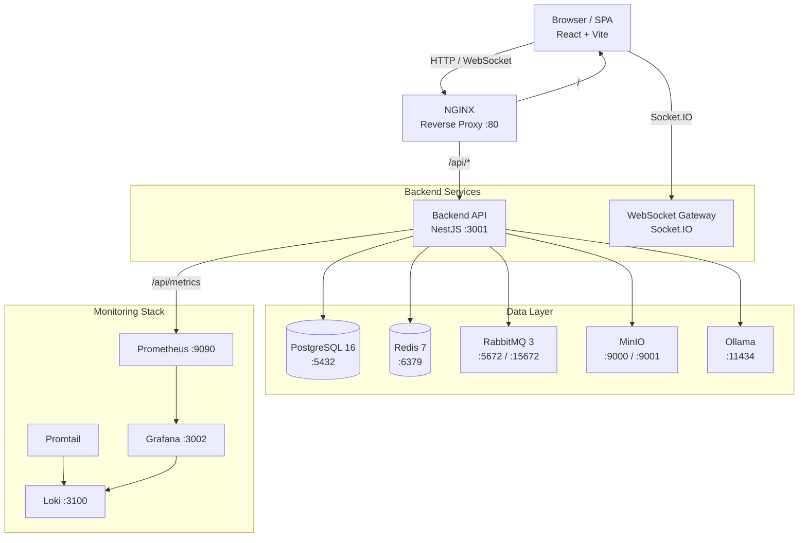
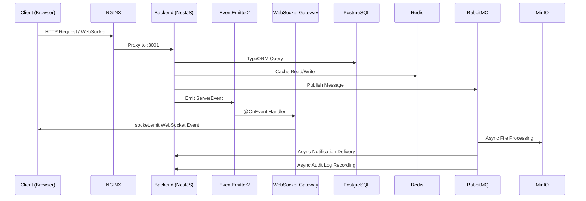

# User & Developer Guide

> Comprehensive documentation for the ChatApp real-time messaging platform — covering end-user workflows, administrator operations, developer onboarding, and operational best practices.

---

## 1. Platform Overview

### 1.1 What Is ChatApp?

ChatApp is a full-stack, real-time messaging platform designed to support direct messaging, group conversations, voice and video calls, AI-powered chat assistants, and enterprise-grade administration. It draws architectural inspiration from platforms like Discord, Slack, and Microsoft Teams while remaining deployable as a self-hosted, Docker Compose-managed system.

The platform is built as a **monorepo** containing a NestJS backend, a React/Vite frontend, and all supporting infrastructure definitions. Every service runs inside Docker containers, making the entire stack reproducible from a single `docker compose up`.

### 1.2 Core Architecture

ChatApp follows a **modular monolith** architecture on the backend with a decoupled two-layer event system for real-time communication. The frontend is a single-page application (SPA) built with React, using Redux Toolkit for state management and Socket.IO for WebSocket connectivity.

#### System Architecture

#### Service Communication

### 1.3 High-Level Components

| Component | Technology | Port | Purpose |
|-----------|-----------|------|---------|
| Reverse Proxy | NGINX (Alpine) | 80 | Routes `/api/*` to backend, serves frontend SPA, proxies WebSocket connections |
| Backend API | NestJS + TypeScript (Bun runtime) | 3001 | REST API, WebSocket gateway, business logic, authentication |
| Frontend SPA | React 18 + Vite + TypeScript | 80/3000 | User interface, real-time updates via Socket.IO |
| Database | PostgreSQL 16 | 5432 | Primary data store — users, messages, conversations, groups, audit logs |
| Cache & Pub/Sub | Redis 7 | 6379 | Session caching, JWT token blacklisting, WebSocket pub/sub for multi-instance scaling |
| Message Queue | RabbitMQ 3 (Management) | 5672/15672 | Async processing — file uploads, notifications, audit logging with DLX retry |
| Object Storage | MinIO (S3-compatible) | 9000/9001 | File attachments, avatars, banners — presigned URL uploads, Sharp thumbnail generation |
| AI Inference | Ollama | 11434 | Local LLM serving for AI chatbot — streaming token-by-token responses |
| Metrics | Prometheus | 9090 | Scrapes backend `/api/metrics` every 15s, stores time-series data |
| Dashboards | Grafana | 3002 | Pre-built dashboards for CPU, memory, request rate, latency |
| Log Aggregation | Loki + Promtail | 3100 | Centralized log collection, querying via Grafana Explore |

### 1.4 Supported Features

#### Messaging & Communication
- **Direct Messages** — One-to-one conversations with cursor-based pagination, message edit/delete, typing indicators, and read receipts
- **Group Chats** — Multi-user conversations with owner/member roles, member management, ownership transfer, and group-level message threading
- **Threads** — Reply to specific messages within a conversation; single nesting depth with paginated thread retrieval
- **Emoji Reactions** — Add/remove emoji reactions on any message (up to 20 per message)
- **File Attachments** — Upload images, documents, and media via MinIO presigned URLs; automatic Sharp thumbnail generation (300px)
- **Search** — Full-text search across messages, users, and groups using PostgreSQL `tsvector`/`tsquery` with GIN index and relevance ranking

#### Real-Time Capabilities
- **WebSocket Events** — All message delivery, typing indicators, read receipts, presence updates, and reactions pushed in real-time via Socket.IO
- **Presence** — Online/offline/away status with custom status messages, "appear offline" mode, and grace period for reconnections
- **Typing Indicators** — Real-time typing state per conversation and group
- **Read Receipts** — Single/double checkmark delivery/read status; batch updates at 1-second intervals; can be disabled per-user
- **Notifications** — Real-time + REST notifications for messages, friend requests, group invites, reactions, mentions, and thread replies; 90-day auto-deletion

#### Voice & Video
- **WebRTC Calls** — Peer-to-peer voice and video calls via PeerJS with STUN/TURN server configuration, mute/camera/screen-share controls, and 30-second call timeout

#### Social
- **Friends** — Send/accept/reject/cancel friend requests; friend list management; real-time friend request notifications; limits of 1000 friends and 50 pending requests
- **User Profiles** — Avatar and banner uploads (MinIO), custom about text, username changes with availability checking, onboarding flow for new users

#### AI Assistant
- **AI Chatbot** — Ollama-powered conversational AI with configurable personas and models; streaming token-by-token responses via WebSocket; per-user private conversation history; admin-managed bot CRUD

#### Administration
- **Role-Based Access** — Three-tier role system: USER, MODERATOR, ADMIN with guarded endpoints
- **User Management** — List users, ban/unban accounts, change roles
- **Content Moderation** — Message deletion, report submission and review workflow
- **Audit Logging** — Immutable audit trail with userId, action, entity, metadata, IP address, and timestamp; filterable via API

### 1.5 Scalability Expectations

The architecture supports both single-instance deployment and horizontal scaling:

- **Single instance** — All services in one Docker Compose stack; suitable for teams of up to several hundred concurrent users
- **Multi-instance** — The Redis adapter for Socket.IO enables multiple backend containers behind a load balancer; RabbitMQ consumers can scale independently; MinIO supports distributed mode
- **Database** — PostgreSQL can be promoted to a managed service (RDS, Cloud SQL) or run with read replicas for read-heavy workloads
- **Kubernetes-ready** — All services are containerized with health checks, making migration to Kubernetes straightforward (see [Section 10: DevOps & Deployment Guide](#10-devops--deployment-guide))

### 1.6 Enterprise Goals

ChatApp is designed to meet the following enterprise requirements:

| Goal | Implementation |
|------|---------------|
| **Security** | JWT dual-token auth (15min access + 7d refresh), HTTP-only refresh cookie, bcrypt password hashing, token blacklisting on logout, rate limiting |
| **Observability** | Prometheus metrics, Grafana dashboards, Loki log aggregation, structured health endpoint, correlation-ready request logging |
| **Compliance** | Audit logging for all admin actions, IP address tracking, data retention policies (90-day notification auto-deletion) |
| **Reliability** | Docker health checks for all services, RabbitMQ dead-letter queues with retry, exponential backoff on connection failures |
| **Maintainability** | Modular monolith with clear module boundaries, string-token DI, enum-based constants, consistent code patterns across all 29 backend modules |
| **Extensibility** | Feature-based module architecture, event-driven decoupling, pluggable AI backend (Ollama), S3-compatible storage abstraction |

---

