# User & Developer Guide

> Comprehensive documentation for the ChatApp real-time messaging platform — covering end-user workflows, administrator operations, developer onboarding, and operational best practices.

---

## 1. Platform Overview

### 1.1 What Is ChatApp?

ChatApp is a full-stack, real-time messaging platform designed to support direct messaging, group conversations, voice and video calls, AI-powered chat assistants, and enterprise-grade administration. It draws architectural inspiration from platforms like Discord, Slack, and Microsoft Teams while remaining deployable as a self-hosted, Docker Compose-managed system.

The platform is built as a **monorepo** containing a NestJS backend, a React/Vite frontend, and all supporting infrastructure definitions. Every service runs inside Docker containers, making the entire stack reproducible from a single `docker compose up`.

### 1.2 Core Architecture

ChatApp follows a **modular monolith** architecture on the backend with a decoupled two-layer event system for real-time communication. The frontend is a single-page application (SPA) built with React, using Redux Toolkit for state management and Socket.IO for WebSocket connectivity.

#### System Architecture

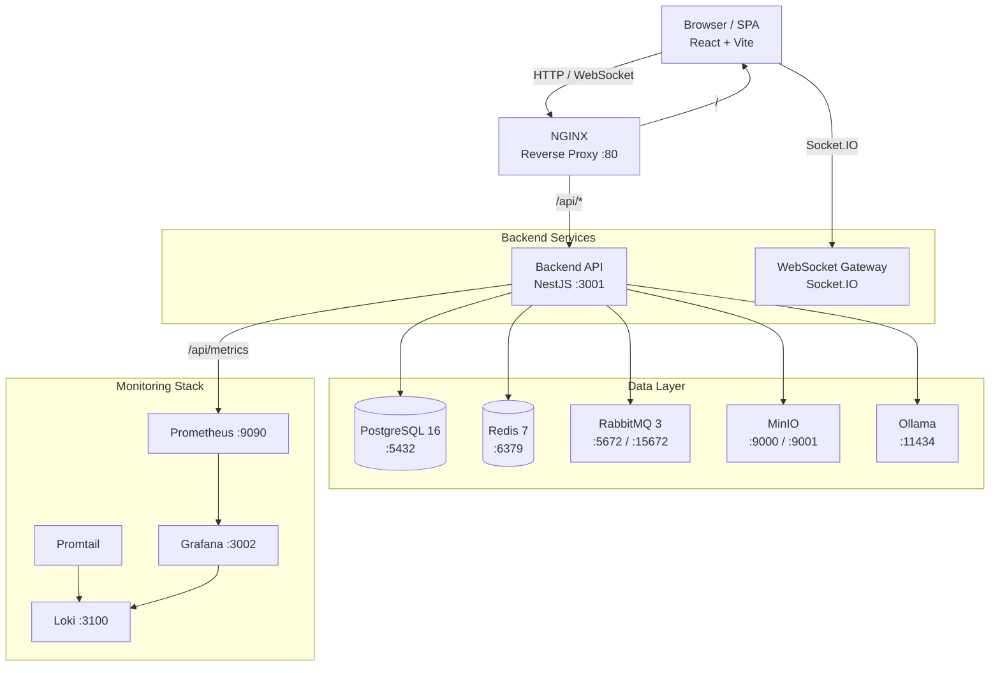

#### Service Communication

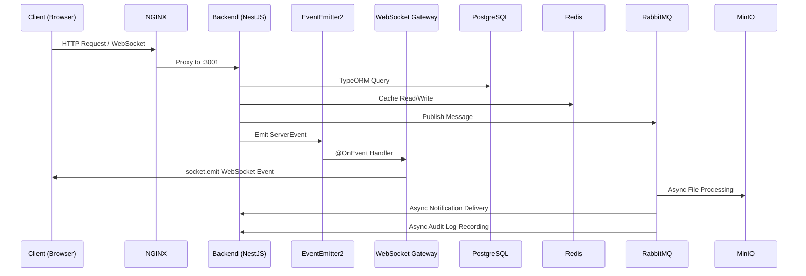

### 1.3 High-Level Components

| Component | Technology | Port | Purpose |
|-----------|-----------|------|---------|
| Reverse Proxy | NGINX (Alpine) | 80 | Routes `/api/*` to backend, serves frontend SPA, proxies WebSocket connections |
| Backend API | NestJS + TypeScript (Bun runtime) | 3001 | REST API, WebSocket gateway, business logic, authentication |
| Frontend SPA | React 18 + Vite + TypeScript | 80/3000 | User interface, real-time updates via Socket.IO |
| Database | PostgreSQL 16 | 5432 | Primary data store — users, messages, conversations, groups, audit logs |
| Cache & Pub/Sub | Redis 7 | 6379 | Session caching, JWT token blacklisting, WebSocket pub/sub for multi-instance scaling |
| Message Queue | RabbitMQ 3 (Management) | 5672/15672 | Async processing — file uploads, notifications, audit logging with DLX retry |
| Object Storage | MinIO (S3-compatible) | 9000/9001 | File attachments, avatars, banners — presigned URL uploads, Sharp thumbnail generation |
| AI Inference | Ollama | 11434 | Local LLM serving for AI chatbot — streaming token-by-token responses |
| Metrics | Prometheus | 9090 | Scrapes backend `/api/metrics` every 15s, stores time-series data |
| Dashboards | Grafana | 3002 | Pre-built dashboards for CPU, memory, request rate, latency |
| Log Aggregation | Loki + Promtail | 3100 | Centralized log collection, querying via Grafana Explore |

### 1.4 Supported Features

#### Messaging & Communication
- **Direct Messages** — One-to-one conversations with cursor-based pagination, message edit/delete, typing indicators, and read receipts
- **Group Chats** — Multi-user conversations with owner/member roles, member management, ownership transfer, and group-level message threading
- **Threads** — Reply to specific messages within a conversation; single nesting depth with paginated thread retrieval
- **Emoji Reactions** — Add/remove emoji reactions on any message (up to 20 per message)
- **File Attachments** — Upload images, documents, and media via MinIO presigned URLs; automatic Sharp thumbnail generation (300px)
- **Search** — Full-text search across messages, users, and groups using PostgreSQL `tsvector`/`tsquery` with GIN index and relevance ranking

#### Real-Time Capabilities
- **WebSocket Events** — All message delivery, typing indicators, read receipts, presence updates, and reactions pushed in real-time via Socket.IO
- **Presence** — Online/offline/away status with custom status messages, "appear offline" mode, and grace period for reconnections
- **Typing Indicators** — Real-time typing state per conversation and group
- **Read Receipts** — Single/double checkmark delivery/read status; batch updates at 1-second intervals; can be disabled per-user
- **Notifications** — Real-time + REST notifications for messages, friend requests, group invites, reactions, mentions, and thread replies; 90-day auto-deletion

#### Voice & Video
- **WebRTC Calls** — Peer-to-peer voice and video calls via PeerJS with STUN/TURN server configuration, mute/camera/screen-share controls, and 30-second call timeout

#### Social
- **Friends** — Send/accept/reject/cancel friend requests; friend list management; real-time friend request notifications; limits of 1000 friends and 50 pending requests
- **User Profiles** — Avatar and banner uploads (MinIO), custom about text, username changes with availability checking, onboarding flow for new users

#### AI Assistant
- **AI Chatbot** — Ollama-powered conversational AI with configurable personas and models; streaming token-by-token responses via WebSocket; per-user private conversation history; admin-managed bot CRUD

#### Administration
- **Role-Based Access** — Three-tier role system: USER, MODERATOR, ADMIN with guarded endpoints
- **User Management** — List users, ban/unban accounts, change roles
- **Content Moderation** — Message deletion, report submission and review workflow
- **Audit Logging** — Immutable audit trail with userId, action, entity, metadata, IP address, and timestamp; filterable via API

### 1.5 Scalability Expectations

The architecture supports both single-instance deployment and horizontal scaling:

- **Single instance** — All services in one Docker Compose stack; suitable for teams of up to several hundred concurrent users
- **Multi-instance** — The Redis adapter for Socket.IO enables multiple backend containers behind a load balancer; RabbitMQ consumers can scale independently; MinIO supports distributed mode
- **Database** — PostgreSQL can be promoted to a managed service (RDS, Cloud SQL) or run with read replicas for read-heavy workloads
- **Kubernetes-ready** — All services are containerized with health checks, making migration to Kubernetes straightforward (see [Section 10: DevOps & Deployment Guide](#10-devops--deployment-guide))

### 1.6 Enterprise Goals

ChatApp is designed to meet the following enterprise requirements:

| Goal | Implementation |
|------|---------------|
| **Security** | JWT dual-token auth (15min access + 7d refresh), HTTP-only refresh cookie, bcrypt password hashing, token blacklisting on logout, rate limiting |
| **Observability** | Prometheus metrics, Grafana dashboards, Loki log aggregation, structured health endpoint, correlation-ready request logging |
| **Compliance** | Audit logging for all admin actions, IP address tracking, data retention policies (90-day notification auto-deletion) |
| **Reliability** | Docker health checks for all services, RabbitMQ dead-letter queues with retry, exponential backoff on connection failures |
| **Maintainability** | Modular monolith with clear module boundaries, string-token DI, enum-based constants, consistent code patterns across all 29 backend modules |
| **Extensibility** | Feature-based module architecture, event-driven decoupling, pluggable AI backend (Ollama), S3-compatible storage abstraction |

---

## 2. End User Guide

This section provides a complete walkthrough for end users of the ChatApp platform. It covers every user-facing feature from registration through day-to-day messaging, real-time collaboration, notifications, and AI assistant interactions.

### 2.1 Authentication

#### Registration

1. Navigate to the registration page from the login screen
2. Enter a **username** (3-30 characters, must be unique)
3. Enter a valid **email address**
4. Create a **password** (minimum 8 characters)
5. Click **Sign Up**
6. Upon success, you are automatically authenticated and redirected to the chat interface
7. An onboarding flow prompts you to set an about message (required) and optionally upload an avatar and banner image

**Error handling:**
- Duplicate username or email returns a 409 Conflict error with a descriptive message
- Invalid input (short password, malformed email) returns 400 Bad Request with specific field errors
- All errors are displayed inline next to the relevant form field

#### Login

1. Enter your **email address** and **password**
2. Click **Log In**
3. Upon success, you receive an access token (valid for 15 minutes) and a refresh token (valid for 7 days, stored as an HTTP-only cookie)

**Error handling:**
- Incorrect credentials return 401 Unauthorized
- Account locked or banned returns a specific error message preventing login
- The frontend automatically retries login on network failure after a brief delay

#### Staying Logged In

The platform uses a dual-token JWT strategy:

| Token | Lifetime | Storage | Purpose |
|-------|----------|---------|---------|
| Access Token | 15 minutes | Memory (Redux store) | Authenticates API requests and WebSocket connections |
| Refresh Token | 7 days | HTTP-only cookie | Automatically exchanged for a new token pair |

The frontend's Axios interceptor automatically detects 401 responses and attempts a silent token refresh using the refresh token. If the refresh succeeds, the original request is retried transparently. If the refresh fails (refresh token expired), the user is redirected to the login page.

**Session longevity:** Staying active at least once every 7 days keeps the session alive indefinitely.

#### Logout

1. Click your **profile avatar** (top-right corner)
2. Select **Log Out**
3. The session is terminated: the access token is blacklisted in Redis, and the refresh token cookie is cleared
4. All open browser tabs are notified and redirect to the login page

#### Password Reset (Future)

Password reset via email is planned but not yet implemented. Currently, administrators can reset passwords through the admin panel.

#### Session Management

- Active sessions are tied to the JWT token pair. Each login creates a new refresh token.
- Logging out invalidates the current refresh token. Other active sessions remain valid until their own tokens expire.
- The platform does not currently expose a "manage active sessions" UI. This is planned for a future release.

### 2.2 Messaging

#### Direct Messages

##### Starting a Conversation

1. Click the **New Message** button in the sidebar
2. Search for a user by username in the search field
3. Select the user from the results
4. Type your message in the input field at the bottom
5. Press **Enter** to send (or **Shift+Enter** for a new line)

If a conversation already exists between you and the selected user, it is opened instead of creating a duplicate.

##### Viewing Conversations

- Conversations are listed in the **left sidebar**, ordered by most recent message
- Each conversation shows the other user's avatar, name, a preview of the last message, and a timestamp
- An **unread badge** displays the count of unread messages
- Clicking a conversation loads the message history with cursor-based pagination (50 messages per page, scrolling up loads more)

##### Sending Messages

- Select a conversation, type in the input field, and press **Enter**
- Messages support up to **4000 characters**
- Messages are delivered in real-time to the recipient via WebSocket (`onMessage` event)
- If the recipient is offline, the message is stored in PostgreSQL and delivered when they reconnect

##### Editing Messages

1. Hover over your message
2. Click the **three-dot menu** that appears
3. Select **Edit**
4. Modify the message content
5. Press **Enter** to save

Edited messages display an **(edited)** indicator visible to all participants. The edit is broadcast to other participants via the `onMessageUpdate` WebSocket event.

##### Deleting Messages

1. Hover over your message
2. Click the **three-dot menu**
3. Select **Delete**
4. Confirm the deletion in the dialog

Deleted messages are removed for **all participants** (not just the sender). Deletion is broadcast via the `onMessageDelete` WebSocket event.

#### Group Chats

##### Creating a Group

1. Click the **New Group** button in the sidebar
2. Enter a **group name** (1-100 characters)
3. Optionally add a **description** (up to 500 characters)
4. Add members by searching and selecting users
5. Click **Create Group**

The creator becomes the **group owner** with administrative privileges.

##### Group Messaging

- Messages work identically to direct messages but are broadcast to **all group members**
- Typing indicators show which member is currently typing
- Group messages support all the same features: editing, deletion, reactions, threads, file attachments

##### Managing Group Members (Owner)

- **Add members:** Open the group info panel, click **Add Member**, search and select a user
- **Remove members:** Click the **X** button next to a member's name in the group info panel
- **Leave group:** Any member (including the owner) can leave via the group info panel
- **Transfer ownership:** In the group info panel, click **Transfer Ownership** next to a member. The previous owner becomes a regular member. This action is irreversible.

**Limits:** Maximum of 256 members per group.

#### Message Threads

##### Replying to a Message

1. Hover over any message
2. Click the **Reply** icon
3. A reply input appears with the original message quoted above it
4. Type your reply and press **Enter**

##### Viewing Threads

- Messages with replies display a thread indicator (e.g., "3 replies") below the message
- Click the indicator to open the **thread panel** on the right side of the screen
- Thread replies are loaded chronologically with pagination (50 per page)
- Close the thread panel with the **X** button

**Limitation:** Threads support only single-depth nesting — you cannot reply to a reply.

#### Emoji Reactions

- **Add a reaction:** Hover over a message, click the **smiley face icon**, and select an emoji from the picker
- **Quick react:** Double-click (or double-tap) a message for a quick thumbs-up reaction
- **View reactions:** Emoji badges appear below the message with a count. Hover over a badge to see who reacted
- **Remove your reaction:** Click the highlighted reaction badge beneath the message
- **Limits:** Up to 20 unique reactions per message. Each user can only add one reaction per emoji

Reactions are delivered in real-time via `onReactionAdd` and `onReactionRemove` WebSocket events.

#### Searching Messages, Users, and Groups

1. Click the **search icon** in the top navigation
2. Type a query (minimum 2 characters)
3. Results appear across three tabs:
   - **Messages** — Full-text search with highlighted matching text, ranked by relevance. Click a result to jump to the message in context
   - **People** — Username search with avatar and online status. Click to view profile or start a conversation
   - **Groups** — Group name search with member counts. Click to open the group
4. Scroll to the bottom of results to load more (pagination)
5. Results are access-controlled: you only see messages from your own conversations and groups, and only groups you belong to

#### File Attachments

##### Uploading Files

1. Click the **paperclip icon** in the message input area
2. Select a file from your device (maximum 10 MB)
3. The file is uploaded to MinIO storage via a presigned URL
4. For images, an automatic thumbnail (300px JPEG) is generated by Sharp
5. The attachment appears inline in the conversation with a download link

**Supported file types:**

| Category | Formats |
|----------|---------|
| Images | JPEG, PNG, GIF, WebP, SVG |
| Documents | PDF, plain text, JSON |
| Video | MP4 |
| Audio | MPEG, OGG, WebM |

##### Viewing and Downloading Attachments

- **Images** display inline with thumbnail previews. Click for full-size view
- **Other files** appear as download links with file name and size
- **Download** by clicking the attachment; a fresh presigned URL is generated with 1-hour expiry
- When async processing completes (thumbnails, metadata), an `onAttachmentProcessed` WebSocket event updates the UI

### 2.3 Real-Time Features

#### Presence Indicators

User presence is shown throughout the interface:

| Indicator | Meaning |
|-----------|---------|
| Green dot | Online — active WebSocket connection |
| Yellow dot | Away — no activity for 5 minutes |
| Gray dot | Offline or "Appear Offline" mode enabled |
| Custom text | Status message displayed below the username |

**Setting your presence:**
- Click your **avatar** in the bottom-left sidebar
- Select **Set Status** and type a message (up to 100 characters)
- Toggle **Appear Offline** to hide your online status from other users

Presence updates are synchronized across all connected clients in real-time via the `onPresenceUpdate` WebSocket event. Online friends are visible in the friends list, and online group members appear in the group sidebar.

#### Typing Indicators

When someone is composing a message in a conversation or group you have open, you see **"User is typing..."** below the message input area. This indicator:
- Appears within milliseconds of the other user starting to type
- Disappears when they stop typing or send the message
- Works in both direct messages and group chats
- Uses `typingStart`/`typingStop` events for conversations and `groupTypingStart`/`groupTypingStop` for groups

#### Delivery Status and Read Receipts

Message status is indicated by checkmarks:

| Checkmark | Meaning |
|-----------|---------|
| Single gray checkmark | Message delivered to the server |
| Double gray checkmarks | Message delivered to the recipient's device |
| Double colored checkmarks | Message read by the recipient |

**Behavior:**
- Messages are automatically marked as read when you open a conversation
- Read receipt updates are batched at 1-second intervals to reduce network overhead
- You can disable sending read receipts in **Settings > Privacy** — when disabled, others will not see the colored double checkmarks for your messages

**Disabling read receipts:** If you toggle off "Send Read Receipts," the server stops emitting `onMessageRead` events for your reads. Other users will only see the gray double checkmarks (delivered status).

#### Reconnection Handling

If your network connection drops:

1. Socket.IO automatically attempts to reconnect with exponential backoff
2. While disconnected, a connection status indicator appears in the UI
3. Upon reconnection, the client fetches missed messages via REST API (conversation messages endpoint with cursor-based pagination)
4. Presence status shows a grace period — you are not immediately marked offline during brief disconnects
5. The WebSocket handshake re-authenticates using your current access token

#### Voice and Video Calls

##### Initiating a Call

1. Open a direct message conversation with the user you want to call
2. Click the **Phone icon** (voice call) or **Video Camera icon** (video call) in the conversation header
3. The other user receives a ringing notification with your name and avatar

##### Receiving a Call

- A call overlay appears with the caller's name and avatar
- Click the **green phone icon** to accept or the **red phone icon** to decline
- If unanswered within 30 seconds, the call automatically times out

##### During a Call

The call interface provides the following controls:
- **Mute/Unmute** — Toggle microphone
- **Camera On/Off** — Toggle video camera
- **Screen Share** — Share your screen with the other participant
- **Hang Up** — End the call

**Technical details:**
- Calls use **WebRTC** via PeerJS for peer-to-peer media streaming
- Signaling (call initiation, acceptance, hangup) is relayed through the WebSocket gateway
- STUN servers assist with NAT traversal; TURN servers can be configured for restrictive networks
- Quality adapts automatically to network conditions, degrading to audio-only on poor connections

### 2.4 Notifications

#### Notification Types

| Type | Icon | Trigger | Data |
|------|------|---------|------|
| New Message | Chat bubble | Message in inactive conversation | conversationId, senderId |
| Friend Request | User+ | Someone sends you a friend request | requestorId |
| Group Invite | Users | Added to a group | groupId, addedByUserId |
| Reaction | Emoji | Someone reacts to your message | messageId, emoji, userId |
| Mention | @ symbol | Someone mentions you (future) | messageId, conversationId |
| Thread Reply | Reply arrow | Someone replies to your message or a thread you follow | messageId, parentMessageId |

#### Viewing Notifications

- Click the **bell icon** in the top navigation bar
- A dropdown displays recent notifications with:
  - Category icon and color
  - Title (e.g., "John sent you a friend request")
  - Timestamp
  - Unread notifications are highlighted; a badge count appears on the bell icon
- Clicking a notification navigates to the relevant context (opens the conversation, shows the message, etc.)
- Friend request notifications include inline **Accept** and **Reject** buttons

#### Managing Notifications

- **Mark as read:** Clicking a notification automatically marks it as read. Use **Mark All as Read** at the top of the panel
- **Sounds:** A short notification sound plays for new notifications. Toggle in **Settings > Notifications > Notification Sounds**
- **Auto-deletion:** Notifications older than 90 days are automatically deleted by the system

### 2.5 AI Assistant Usage

ChatApp includes AI-powered chatbots that run locally via Ollama, providing private, on-device AI conversations.

#### Starting an AI Conversation

1. Look for bots in the **conversation sidebar** — they appear with a **robot icon**
2. Click a bot to start a new conversation, or continue an existing one
3. Type your message and press **Enter**
4. The bot responds with **streaming output** — characters appear one at a time, simulating real-time typing

#### AI Features

- **Multiple bots:** Different bots have different personas and capabilities (e.g., a general assistant, a code helper, a creative writer)
- **Streaming responses:** Tokens are delivered in real-time via `onAIStreamChunk` events, providing immediate feedback
- **Conversation history:** Each bot maintains a separate, private conversation history per user — only you can see your AI conversations
- **Persistent conversations:** Leave and return to bot conversations at any time; history is preserved in PostgreSQL

#### AI Limitations

- **Availability:** AI features require the Ollama service to be running. If Ollama is unavailable, sending a message to a bot returns a 503 Service Unavailable error
- **Model quality:** Response quality depends on the configured Ollama model. Smaller models are faster but less capable
- **Latency:** First response after model loading may take several seconds. Subsequent responses are faster
- **No internet required:** Since Ollama runs locally, AI conversations work completely offline (within the Docker network)

### 2.6 Friends

#### Adding Friends

1. Click the **Add Friend** button in the friends panel
2. Search by username
3. Click **Send Friend Request**

The other user receives a real-time notification and can accept or reject the request.

#### Managing Friend Requests

- **Incoming requests:** Appear in the **Friends tab > Pending Requests** section with Accept/Reject buttons
- **Outgoing requests:** Visible in **Friends tab > Sent Requests** with a Cancel option
- Accepted requests immediately add both users to each other's friends list

**Limits:** Maximum 1000 friends per user, 50 pending friend requests at a time. Requests expire after 30 days if not acted upon.

#### Using the Friends List

- Friends are displayed alphabetically with **online indicators** (green/yellow/gray dots)
- Click a friend to open a direct message conversation
- Right-click (or long-press on mobile) for options: **Remove Friend**, **View Profile**

### 2.7 User Settings

#### Profile Customization

| Setting | Details |
|---------|---------|
| Avatar | JPG/PNG, max 5 MB. Click avatar > Edit Profile > camera icon |
| Banner | Recommended 1500x400px, max 10 MB. Settings > Profile > Change Banner |
| About text | Max 200 characters. Visible on your profile. Settings > Profile > About |
| Username | Check availability at Settings > Profile. Changes are immediate |

#### Appearance

- **Theme:** Toggle between **Dark** and **Light** mode in **Settings > Appearance**
- The theme applies instantly and persists across sessions via Redux store and local storage
- Both themes are built with styled-components and a shared theme object (`DarkTheme` / `LightTheme`)

#### Onboarding

New users are guided through an onboarding flow after registration:
1. Set an **about message** (required)
2. Optionally upload an **avatar** and **banner**
3. Click **Continue to Chat** to enter the main interface

### 2.8 Accessibility

#### Keyboard Navigation

The application supports standard keyboard navigation patterns:
- **Tab** to move between interactive elements
- **Enter** to activate buttons and submit forms
- **Escape** to close modals, dropdowns, and panels
- **Arrow keys** for list navigation in search results and menus
- **Shift+Enter** for new lines in message input fields

#### Screen Reader Support

- Semantic HTML is used throughout (`<nav>`, `<main>`, `<aside>`, `<button>`, `<form>`)
- ARIA labels are applied to icon-only buttons and interactive elements
- Notification badges and status indicators include accessible text alternatives
- Modal dialogs trap focus and announce their purpose

#### Mobile Responsiveness

The interface is responsive and adapts to different screen sizes:
- **Desktop (>1024px):** Full three-column layout — sidebar (conversations), main panel (messages), optional side panel (thread/group info)
- **Tablet (768-1024px):** Two-column layout — sidebar collapses to icons, side panel becomes a full-screen overlay
- **Mobile (<768px):** Single-column layout — navigation between panels via swipe or back button; bottom navigation bar for key sections

#### Internationalization

The current interface is in English only. Internationalization (i18n) is planned for a future release. The React component structure is designed to support future string extraction and locale switching.

---

## 3. Admin & Moderator Guide

### 3.1 Role Hierarchy

The platform uses a three-tier role-based access control system:

| Role | Capabilities |
|------|-------------|
| **USER** | Standard access — messaging, groups, friends, calls, file uploads. Can submit reports against other users |
| **MODERATOR** | All USER capabilities + delete any message across conversations and groups, review and resolve user reports |
| **ADMIN** | All MODERATOR capabilities + ban/unban user accounts, change user roles, view audit logs. Only ADMINs can promote other users |

New users are assigned the `USER` role by default. Role assignment can only be changed by an existing ADMIN, and administrators cannot change their own role.

### 3.2 Admin Panel Access

1. Click the **gear icon** (Settings) in the bottom-left sidebar
2. Select **Admin** from the settings menu
3. The admin panel loads with three tabs: **Users**, **Reports**, and **Audit**

Access is guarded by backend role checks — requests from users without the required role receive `403 Forbidden` responses.

### 3.3 User Management

#### Listing Users

Navigate to the **Users tab** in the admin panel. The interface displays a paginated table of all registered users with columns:

| Column | Description |
|--------|-------------|
| Username | Display name with avatar |
| Email | Registered email address |
| Role | Current role (USER / MODERATOR / ADMIN) |
| Status | Active or Banned |
| Joined | Registration date |

**Search:** Filter by username or email using the search field above the table. The backend performs a case-insensitive partial match via the `search` query parameter.

**Pagination:** Default 20 users per page with page navigation controls.

#### Banning Users

1. Find the user in the Users tab (search or browse)
2. Click the **Ban** toggle in the user's row
3. Confirm the action in the dialog

**Effects of banning:**
- The user cannot log in — the login endpoint returns a specific error
- All existing JWT tokens for the user remain valid until they expire (mitigated by the 15-minute access token lifetime)
- The user's messages and conversations remain in the system (not deleted)
- The ban action is recorded in the audit log with the admin's user ID and IP address

**Unbanning** reverses the restriction — the user can log in normally again.

#### Changing User Roles

1. Find the user in the Users tab
2. Click the **Role** dropdown in the user's row
3. Select the new role (USER, MODERATOR, or ADMIN)
4. Confirm the action

**Constraints:**
- Cannot change your own role
- Only ADMINs can perform role changes
- Role changes take effect immediately — the user's next request is evaluated against their new role
- The action is recorded in the audit log

### 3.4 Content Moderation

#### Deleting Messages

Moderators and administrators can delete any message across all conversations and groups:

1. Locate the offending message (either in the conversation view or via a report)
2. Click the message's context menu (three dots) — this shows the admin **Delete** option in addition to the standard options
3. Confirm the deletion

Deleted messages are removed for **all participants**, and the deletion is broadcast via the `onMessageDelete` WebSocket event. The deletion is recorded in the audit log with the moderator's identity and the message's original content stored in the metadata.

#### Report Review Workflow

Users can submit reports against other users, optionally referencing a specific message. Reports flow through a status lifecycle:

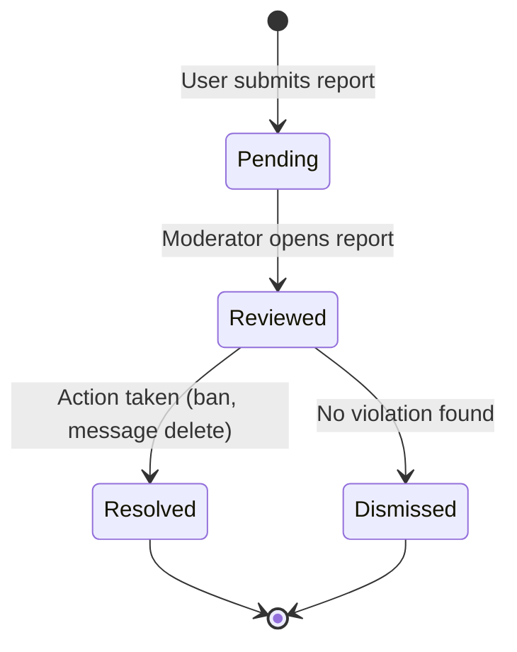

**Moderator workflow:**

1. Open the **Reports tab** in the admin panel
2. Reports with `pending` status are highlighted for immediate attention
3. Click a report to view details:
   - Reported user's profile (username, email, registration date)
   - Reporter's identity
   - Reason for the report (free-text)
   - Referenced message content (if applicable)
4. Assess the report:
   - **Resolve** — Take action (delete message, ban user) and mark as resolved
   - **Dismiss** — No violation found; mark as dismissed
   - **Review** — Mark as reviewed while investigating (intermediate status)

**Filtering:** Reports can be filtered by status (`pending`, `reviewed`, `resolved`, `dismissed`) and paginated (default 20 per page).

### 3.5 Audit Logging

#### Overview

Every write operation (create, update, delete) performed through the admin panel is automatically recorded in an immutable audit log. The audit processor runs as a RabbitMQ consumer, ensuring reliable delivery even during high traffic.

**Audit log schema:**

| Field | Type | Description |
|-------|------|-------------|
| `userId` | UUID | The admin who performed the action |
| `action` | String | `CREATE`, `UPDATE`, or `DELETE` |
| `entity` | String | Entity type affected (User, Message, Group, etc.) |
| `entityId` | String | UUID or ID of the affected entity |
| `metadata` | JSONB | Additional context — previous values, reason, related IDs |
| `ipAddress` | String | Request source IP address |
| `createdAt` | Date | Timestamp of the action |

#### Viewing Audit Logs

1. Open the **Audit tab** in the admin panel
2. The log displays entries in reverse chronological order (newest first)
3. Apply filters:
   - **User** — Filter by the admin who performed the action
   - **Action** — Filter by type (CREATE, UPDATE, DELETE)
   - **Entity** — Filter by entity type (User, Message, Group)
   - **Date range** — Filter by `from` and `to` dates (ISO 8601 format)
4. Default pagination: 50 entries per page

**Use cases for audit log review:**
- **Accountability:** Track who banned a user, who deleted a message, who changed a role
- **Compliance:** Provide evidence of moderation actions for legal or regulatory inquiries
- **Incident investigation:** Correlate admin actions with user reports of issues
- **Insider threat detection:** Monitor for unusual admin activity patterns (future — alerting integration)

### 3.6 Security Considerations for Administrators

- **Authentication required:** All admin endpoints require a valid JWT access token with the appropriate role claim
- **Authorization at the API level:** Backend guards check the user's role before processing any admin request — the UI restrictions are a convenience, not a security boundary
- **IP logging:** Every admin action is logged with the source IP address for forensic purposes
- **Audit immutability:** Audit logs are append-only; there is no API to modify or delete audit entries
- **Role escalation prevention:** Admins cannot change their own role, preventing self-demotion or self-promotion beyond the current level

---

## 4. Developer Guide

### 4.1 Local Setup

#### Prerequisites

- **Docker** + **Docker Compose** (for containerized services)
- **Node.js 18+** and **Yarn** (for local development without Docker)
- **Bun** runtime (used in CI and Docker — optional for local dev)
- **Git**

#### Clone the Repository

```bash
git clone <repository-url>
cd chatapp
```

#### Option A: Full Docker Compose (Recommended)

This starts every service — PostgreSQL, Redis, MinIO, RabbitMQ, Ollama, backend, frontend, and NGINX — with a single command:

```bash
npm run docker:up:d
```

Wait ~30 seconds for all services to pass health checks. Monitor progress:

```bash
npm run docker:logs:backend
```

The seed container automatically creates the superuser account on first run.

**Access:**

| Service | URL |
|---------|-----|
| Frontend (via NGINX) | http://localhost |
| Backend API | http://localhost/api |
| Swagger Docs | http://localhost/api/docs |
| MinIO Console | http://localhost:9001 |
| RabbitMQ Management | http://localhost:15672 |
| Health Check | http://localhost/api/health |

#### Option B: Dev Mode with Hot Reload

Uses the Docker Compose override that mounts local source directories into containers:

```bash
npm run docker:up:dev:d
```

The override mounts `apps/backend/src` and `apps/frontend/src` for live reloading. Changes you make locally are reflected immediately inside the Docker containers.

#### Option C: Local Backend + Docker Infrastructure

Run only infrastructure services in Docker, and the backend/frontend locally:

```bash
# Start infrastructure only
docker compose up postgres redis rabbitmq minio -d

# Backend
cd apps/backend
yarn install
yarn migration:run
yarn seed
yarn start:dev

# Frontend (separate terminal)
cd apps/frontend
yarn install
yarn start:dev
```

The frontend Vite dev server (port 3000) proxies `/api` and `/socket.io` requests to `localhost:3001` automatically.

#### With Monitoring Stack

```bash
npm run docker:up:monitoring
```

This adds Prometheus (port 9090), Grafana (port 3002), and Loki (port 3100) alongside the main services.

### 4.2 Environment Variables

All configuration is managed through `.env.docker` at the repository root. The file is tracked in git with safe defaults for local development.

#### Core Settings

| Variable | Default | Description |
|----------|---------|-------------|
| `NODE_ENV` | `development` | Node environment |
| `ENVIRONMENT` | `development` | Application environment (`development` or `PRODUCTION`) |
| `PORT` | `3001` | Backend API port |
| `BACKEND_PORT` | `3001` | Backend port (Docker mapping) |
| `FRONTEND_PORT` | `3000` | Frontend Vite dev server port |
| `NGINX_HTTP_PORT` | `80` | NGINX entry point port |

#### Database

| Variable | Default | Security Implication |
|----------|---------|---------------------|
| `DATABASE_HOST` | `postgres` | Docker service name; use `localhost` for local dev |
| `DATABASE_PORT` | `5432` | Standard PostgreSQL port |
| `DATABASE_USERNAME` | `chatapp` | **Change in production** — default is a well-known credential |
| `DATABASE_PASSWORD` | `chatapp_secret` | **Must change in production** — tracked in git with weak default |
| `DATABASE_NAME` | `chatapp` | Database name |

**Production recommendation:** Use a managed database service (RDS, Cloud SQL) with strong, randomly generated credentials stored in a secrets manager (Vault, AWS Secrets Manager). Never commit database credentials to version control.

#### Authentication

| Variable | Default | Security Implication |
|----------|---------|---------------------|
| `JWT_SECRET` | `change-this-to-a-random-jwt-secret` | **Critical — must change in production.** Used to sign access tokens. If compromised, attackers can forge tokens |
| `JWT_REFRESH_SECRET` | `change-this-to-a-random-refresh-secret` | **Critical — must change in production.** Used to sign refresh tokens |
| `COOKIE_SECRET` | `change-this-to-a-random-secret` | **Must change in production.** Used to sign cookies |

**Production recommendation:** Generate cryptographically random secrets (at least 256 bits / 32 bytes) and store them in a secrets manager. Rotate secrets periodically. Use separate secrets per environment (dev, staging, prod).

#### Superuser

| Variable | Default | Description |
|----------|---------|-------------|
| `SUPERUSER_USERNAME` | `admin` | Admin account username created by seed script |
| `SUPERUSER_PASSWORD` | `changeme123!` | **Must change before first deployment** |
| `SUPERUSER_EMAIL` | `admin@chatapp.local` | Admin account email |

**Security note:** The seed script runs automatically on first `docker compose up`. Change these defaults in `.env.docker` before deploying to any shared environment.

#### Redis

| Variable | Default | Description |
|----------|---------|-------------|
| `REDIS_HOST` | `redis` | Redis service hostname |
| `REDIS_PORT` | `6379` | Redis port |

Used for: caching (5-minute TTL), JWT token blacklisting (TTL matches token lifetime), WebSocket pub/sub via Socket.IO Redis adapter.

#### RabbitMQ

| Variable | Default | Description |
|----------|---------|-------------|
| `RABBITMQ_HOST` | `rabbitmq` | RabbitMQ service hostname |
| `RABBITMQ_PORT` | `5672` | AMQP port |
| `RABBITMQ_USER` | `chatapp` | Username |
| `RABBITMQ_PASSWORD` | `chatapp_secret` | **Change in production** |

Used for: async file upload processing, notification delivery, audit log recording. All queues have dead-letter exchanges with 3 retry attempts and exponential backoff.

#### Object Storage (MinIO)

| Variable | Default | Description |
|----------|---------|-------------|
| `MINIO_ROOT_USER` | `minioadmin` | MinIO admin username |
| `MINIO_ROOT_PASSWORD` | `minioadmin` | **Must change in production** |
| `MINIO_ENDPOINT` | `minio` | Service hostname |
| `MINIO_PORT` | `9000` | S3 API port |
| `MINIO_API_PORT` | `9000` | API port (Docker mapping) |
| `MINIO_CONSOLE_PORT` | `9001` | Web console port |
| `MINIO_USE_SSL` | `false` | Enable SSL for S3 connections |
| `MINIO_ACCESS_KEY` | `minioadmin` | S3 access key |
| `MINIO_SECRET_KEY` | `minioadmin` | **Must change in production** |
| `S3_BUCKET` | `chatapp-uploads` | Primary storage bucket |

Three buckets are auto-created by `docker/minio/init-buckets.sh`: `chatapp-uploads`, `chatapp-avatars`, `chatapp-attachments`.

**Production recommendation:** Replace MinIO with a managed S3 service (AWS S3, GCS) for durability and availability. Enable SSL. Use IAM roles or presigned URLs instead of long-lived access keys.

#### AI (Ollama)

| Variable | Default | Description |
|----------|---------|-------------|
| `OLLAMA_HOST` | `http://ollama:11434` | Ollama service URL |
| `OLLAMA_PORT` | `11434` | Ollama port (Docker mapping) |

The Ollama container uses a persistent volume (`ollama_data`) for downloaded models. First-time model pulls can take several minutes depending on model size.

#### Monitoring

| Variable | Default | Description |
|----------|---------|-------------|
| `PROMETHEUS_PORT` | `9090` | Prometheus web UI |
| `GRAFANA_PORT` | `3002` | Grafana dashboard |
| `LOKI_PORT` | `3100` | Loki log aggregation |
| `GRAFANA_ADMIN_USER` | `admin` | **Change in production** |
| `GRAFANA_ADMIN_PASSWORD` | `admin` | **Must change in production** |

#### CORS

| Variable | Default | Description |
|----------|---------|-------------|
| `CORS_ORIGIN` | `http://localhost,http://localhost:3000` | Comma-separated allowed origins |

**Production recommendation:** Set to your exact frontend domain(s). Never use `*` in production.

### 4.3 Running Tests

#### Backend Unit Tests

```bash
cd apps/backend
yarn test                          # All tests, parallel (--maxWorkers=50%)
yarn test -- --testPathPattern=auth # Specific module
yarn test:watch                    # Watch mode
yarn test:cov                      # With coverage report
yarn test:e2e                      # End-to-end tests
```

Tests use Jest with `@swc/jest` transform and run from `src/` matching `*.spec.ts`.

#### Frontend Tests

```bash
cd apps/frontend
yarn test                          # Vitest run
yarn test -- --watch               # Watch mode
yarn test -- --coverage            # With coverage
```

Tests use Vitest with `jsdom` environment.

#### E2E Tests

```bash
npx playwright install             # First time only
npx playwright test                # Run E2E test suite
```

E2E tests use Playwright with Chromium, defined in `tests/e2e/`. They require the full Docker Compose stack running.

### 4.4 Useful Commands Reference

```bash
# Docker Compose (from repo root)
npm run docker:up              # Start all services (attached)
npm run docker:up:d            # Start all services (detached)
npm run docker:up:dev          # Start with dev overrides (attached)
npm run docker:up:dev:d        # Start with dev overrides (detached)
npm run docker:up:monitoring   # Start with monitoring stack
npm run docker:down            # Stop all services
npm run docker:down:volumes    # Stop and remove all data volumes
npm run docker:logs            # Tail all service logs
npm run docker:logs:backend    # Tail backend logs only

# Backend (from apps/backend/)
yarn start:dev                 # Dev server with watch mode
yarn build                     # SWC compilation to dist/
yarn lint                      # ESLint with auto-fix
yarn seed                      # Create superuser account
yarn migration:run             # Run pending migrations
yarn migration:generate src/migrations/Name  # Generate migration
yarn migration:revert          # Revert last migration

# Frontend (from apps/frontend/)
yarn start:dev                 # Vite dev server on port 3000
yarn build                     # Production build to dist/
```

---

## 5. Repository Walkthrough

### 5.1 Top-Level Structure

```
chatapp/
├── apps/                        # Application source code
│   ├── backend/                 # NestJS backend (TypeScript, Bun runtime)
│   └── frontend/                # React frontend (Vite, TypeScript)
├── docker/                      # Docker configuration files
│   ├── backend.Dockerfile       # Multi-stage backend Docker build
│   ├── backend-entrypoint.sh    # Backend startup script (migration + seed)
│   ├── frontend.Dockerfile      # Multi-stage frontend Docker build
│   ├── nginx/                   # NGINX reverse proxy config
│   ├── grafana/                 # Grafana provisioning (dashboards, datasources)
│   ├── loki/                    # Loki configuration
│   ├── minio/                   # MinIO bucket initialization script
│   ├── prometheus/              # Prometheus scrape configuration
│   ├── promtail/                # Promtail log shipping config
│   └── rabbitmq/                # RabbitMQ configuration
├── docs/                        # Documentation (this guide + feature docs)
│   ├── features/                # Feature-specific documentation (15 files)
│   ├── architecture.md          # System architecture deep-dive
│   ├── dev-guide.md             # Quick start developer guide
│   ├── run-guide.md             # How to run the application
│   └── frontend.md              # Frontend architecture guide
├── tests/                       # Test suites
│   ├── e2e/                     # Playwright end-to-end tests (6 spec files)
│   ├── setup/                   # Test fixtures and helpers
│   └── integration/             # Integration tests (placeholder)
├── .env.docker                  # Environment variables (tracked with safe defaults)
├── .github/workflows/ci.yml    # CI pipeline (lint, test, build, E2E, Docker)
├── docker-compose.yml           # Main service definitions (9 services)
├── docker-compose.override.yml  # Dev mode overrides (source mounts)
├── docker-compose.monitoring.yml # Monitoring stack (Prometheus, Grafana, Loki)
├── package.json                 # Root scripts for Docker operations + Playwright
├── playwright.config.ts         # E2E test configuration
├── vercel.json                  # Frontend Vercel deployment config
└── CLAUDE.md                    # AI assistant guidance for the codebase
```

### 5.2 Backend Module Structure (`apps/backend/src/`)

The backend follows a modular monolith architecture with 29 feature modules:

| Module | Directory | Purpose |
|--------|-----------|---------|
| Admin | `admin/` | User management, ban/role changes, report review, role guards |
| Audit | `audit/` | Audit log recording via RabbitMQ processor |
| Auth | `auth/` | JWT authentication, registration, login, refresh, guards, strategies |
| Base | `base/` | Shared base controller tests |
| Bot | `bot/` | Ollama AI bot — entities, service, controller, streaming processors |
| Conversations | `conversations/` | Direct message conversations, message CRUD, pagination |
| Events | `events/` | Event definitions for friend requests and friends |
| Exists | `exists/` | Existence checks (username availability, conversation lookup) |
| Friend Requests | `friend-requests/` | Friend request lifecycle — send, accept, reject, cancel |
| Friends | `friends/` | Friends list management, online friends |
| Gateway | `gateway/` | WebSocket gateway — connection, rooms, call signaling, session manager, Redis adapter |
| Groups | `groups/` | Group chats — CRUD, member management, ownership transfer |
| Health | `health/` | Health check endpoint (PostgreSQL + Redis status) |
| Image Storage | `image-storage/` | Sharp image processing and thumbnails |
| Message Attachments | `message-attachments/` | File attachment association with messages |
| Messages | `messages/` | Message entities, DTOs, custom exceptions |
| Notifications | `notifications/` | Notification system — creation, delivery, read status |
| Queue | `queue/` | RabbitMQ queue processors (notification processor) |
| RabbitMQ | `rabbitmq/` | RabbitMQ connection management, channel creation, queue setup |
| Reactions | `reactions/` | Emoji reactions on messages |
| Read Receipts | `read-receipts/` | Message read receipt tracking and batch updates |
| Redis | `redis/` | Redis caching service, token blacklisting, generic cache |
| Search | `search/` | Full-text search via PostgreSQL tsvector/tsquery |
| Seeds | `seeds/` | Database seeding — superuser account creation |
| Storage | `storage/` | MinIO/S3 file storage — presigned URLs, upload, download |
| Telemetry | `telemetry/` | Prometheus metrics — request counter, duration histogram |
| Users | `users/` | User profiles, DTOs, custom exceptions, presence status |
| Utils | `utils/` | Shared constants — `Services`, `Routes`, `ServerEvents`, `WebsocketEvents` enums; TypeORM entities |

**Module pattern:** Each module follows a consistent structure:
1. **Interface file** — Defines the service interface and DI token type
2. **Service class** — Implements business logic
3. **Module registration** — Service registered with `Services` enum token
4. **Controller** — REST endpoints with `Routes` prefix
5. **Tests** — Jest unit tests in `tests/*.spec.ts`

### 5.3 Frontend Structure (`apps/frontend/src/`)

| Directory | Contents |
|-----------|---------|
| `components/` | Reusable UI components — avatars, calls, context-menus, conversations, forms (login, register, create group), friends, groups, messages, modals, navbar, recipients, settings, sidebars, users |
| `guards/` | Route guards — `ConversationPageGuard`, `GroupPageGuard` |
| `pages/` | Route-level pages — Login, Register, App, conversations, groups, friends, settings, calls, onboarding |
| `store/` | 16 Redux slices — conversation, selected, messageContainer, group, groupMessage, groupRecipientsSidebar, messages, friends, call, message-panel, rate-limit, settings, system-messages, modals |
| `utils/` | API client (`api.ts`), TypeScript types, constants, helpers, React contexts (Auth, Socket, MessageMenu), hooks (useAuth, useConversationGuard, useDebounce, useGroupGuard, useToast, socket hooks), styled-components styles, themes (DarkTheme/LightTheme) |

### 5.4 Docker Configuration (`docker/`)

| File | Purpose |
|------|---------|
| `backend.Dockerfile` | Multi-stage build: `development` (Bun + source mount), `build` (SWC compile), `production` (Bun runtime + compiled output) |
| `backend-entrypoint.sh` | Runs migrations, seeds database, then starts the server |
| `frontend.Dockerfile` | Multi-stage build: `development` (Vite dev server), `build` (Vite production build), `production` (NGINX serves static files) |
| `nginx/nginx.conf` | Reverse proxy: `/api/*` and `/socket.io/*` to backend, everything else to frontend. Includes WebSocket upgrade headers |
| `minio/init-buckets.sh` | Creates `chatapp-uploads`, `chatapp-avatars`, `chatapp-attachments` buckets on first start |
| `prometheus/prometheus.yml` | Scrape config targeting backend `/api/metrics` every 15 seconds |
| `grafana/provisioning/` | Auto-loaded Grafana datasources (Prometheus, Loki) and pre-built dashboard JSON |

---

## 6. Frontend Developer Guide

### 6.1 React Architecture

The frontend is a **single-page application** (SPA) built with React 18, using Vite 6 as the build tool. The application follows a feature-based component architecture with clear separation between pages (route-level), reusable components, state management, and utility layers.

**Key architectural decisions:**

| Decision | Choice | Rationale |
|----------|--------|-----------|
| Build tool | Vite 6 | Fast HMR, native ESM, optimized production builds. Significantly faster than webpack for development |
| State management | Redux Toolkit | Predictable state, devtools integration, well-suited for complex real-time applications with many interdependent slices |
| Routing | React Router v6 | Nested routes with `<Outlet />`, lazy loading for code splitting |
| Styling | styled-components (primary) + SCSS Modules (secondary) | Theme support, scoped styles, dynamic styling based on props |
| Forms | React Hook Form | Performant, minimal re-renders, built-in validation |

### 6.2 Routing and Code Splitting

All page components are **lazy-loaded** using `React.lazy()` and `Suspense`, reducing the initial bundle size:

```typescript
const LoginPage = lazy(() => import('./pages/LoginPage'));
const ConversationPage = lazy(() => import('./pages/conversations/ConversationPage'));
```

**Route guard pattern:**
- `<AuthenticatedRoute>` wraps all protected routes — checks `AuthContext` for a valid user
- `ConversationPageGuard` and `GroupPageGuard` validate that the conversation/group exists before rendering the channel view
- Nested routes use the sidebar + outlet pattern: the parent renders the sidebar, and `<Outlet />` renders the specific content panel

### 6.3 State Management

Redux Toolkit manages 14 domain-specific slices. The state architecture follows a flat, normalized pattern:

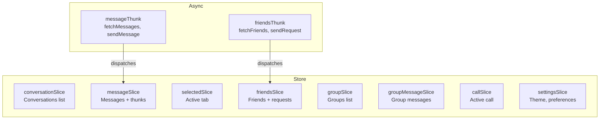

**Async operations** use `createAsyncThunk`:
- API calls are defined as thunks (e.g., `fetchConversations`, `fetchMessages`)
- Thunks dispatch `pending`, `fulfilled`, and `rejected` actions automatically
- Components dispatch thunks and read state via `useSelector` and `useDispatch`
- Loading and error states are tracked in each slice

**Why Redux Toolkit over alternatives:**
- The application has 14+ interdependent state slices with cross-slice communication (e.g., receiving a message updates both the messages slice and the conversation list's last message preview)
- The Redux DevTools extension provides full state inspection and time-travel debugging, critical for real-time applications
- `createAsyncThunk` provides a consistent pattern for all API interactions with built-in loading/error states
- Zustand or Context API would require more boilerplate for this level of state complexity

### 6.4 API Layer

The API client (`src/utils/api.ts`) is a pre-configured Axios instance:

**JWT lifecycle:**
1. On login, the access token is stored in the Redux store (memory only — not localStorage for security)
2. Every API request includes the token via an Axios request interceptor
3. On a 401 response, the interceptor automatically calls `POST /auth/refresh` (using the HTTP-only refresh cookie)
4. If the refresh succeeds, the original request is retried with the new token
5. If the refresh fails, the user is redirected to the login page

**WebSocket authentication:**
- The Socket.IO connection includes the access token in the `auth` field
- Token is sent once during the WebSocket handshake — no per-message auth overhead
- If the token expires during a connected session, the client must reconnect with a fresh token

### 6.5 Theming

The application supports dark and light themes using styled-components' `ThemeProvider`:

- Theme objects (`DarkTheme` / `LightTheme`) define a complete set of design tokens: colors, spacing, typography, borders, shadows
- Components access theme values via `${props => props.theme.primaryBackground}`
- Theme selection is stored in the Redux `settings` slice and persisted both locally and on the server
- Adding a new theme requires only creating a new theme object that satisfies the same interface

### 6.6 Error Handling

- `<ErrorBoundary>` wraps the entire application, catching render errors and displaying a fallback UI
- API errors are handled at the thunk level — rejected thunks populate error state in their respective slices
- React Toastify displays error notifications for API failures
- Network errors trigger reconnection logic in the Axios interceptor and Socket.IO client

### 6.7 Anti-Patterns to Avoid

| Anti-Pattern | Correct Approach |
|-------------|-----------------|
| Storing tokens in `localStorage` | Use memory (Redux store) — the HTTP-only refresh cookie handles persistence |
| Fetching data in `useEffect` | Use `createAsyncThunk` and dispatch from thunks |
| Prop-drilling deeply | Use Redux `useSelector` for shared state; use Context only for truly scoped state (Auth, Socket) |
| Direct DOM manipulation | Use React state and refs |
| Inline styles mixed with styled-components | Pick one system — prefer styled-components for theme integration |
| Mutating Redux state directly | Always use Immer-powered reducers from `createSlice` |

---

## 7. Backend Developer Guide

### 7.1 NestJS Architecture

The backend is a **NestJS modular monolith** running on Bun runtime. All API routes are prefixed with `/api` (set via `app.setGlobalPrefix('api')` in `main.ts`). The application boots with:

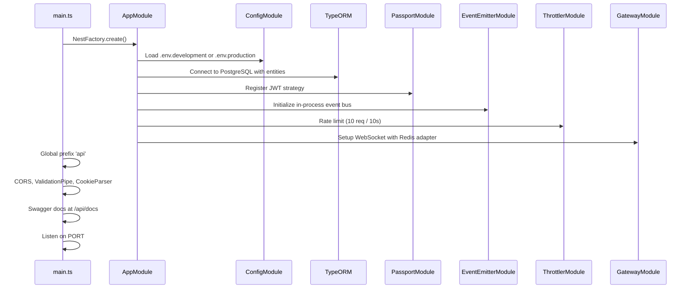

**Global providers registered in `AppModule`:**
- `ThrottlerBehindProxyGuard` — Rate limiting applied to all endpoints (10 requests per 10 seconds)
- `TelemetryInterceptor` — Prometheus metrics collection for every HTTP request

### 7.2 Dependency Injection Pattern

Services use string tokens from the `Services` enum rather than class-based tokens. This decouples consumers from concrete implementations:

```typescript
// Registration (in the module)
providers: [
  { provide: Services.CONVERSATIONS, useClass: ConversationsService },
]

// Consumption (in a controller or other service)
constructor(
  @Inject(Services.CONVERSATIONS)
  private readonly conversationService: IConversationsService,
) {}
```

**Key enums in `src/utils/constants.ts`:**
- `Services` — DI tokens for all injectable services (e.g., `CONVERSATIONS`, `MESSAGES`, `FRIENDS`)
- `Routes` — API route prefixes for all controllers (e.g., `AUTH`, `CONVERSATIONS`, `GROUPS`)
- `ServerEvents` — Internal event names emitted by controllers (e.g., `MESSAGE_CREATE`, `FRIEND_REQUEST_RECEIVED`)
- `WebsocketEvents` — Client-facing WebSocket event names (e.g., `onMessage`, `onFriendRequestReceived`)

### 7.3 Module Pattern

Every backend module follows a consistent structure:

```
src/<module>/
├── <module>.module.ts          # NestJS module registration
├── <module>.controller.ts      # REST endpoints with @Routes prefix
├── <module>.service.ts         # Business logic implementation
├── <module>.ts                 # Service interface (I<ServiceName>Service)
├── dtos/                       # class-validator decorated DTOs
├── exceptions/                 # Custom HttpException subclasses
├── middlewares/                # Route-level access control
└── tests/                      # *.spec.ts Jest unit tests
```

**Creating a new module:**
1. Define the service interface in `<module>.ts`
2. Implement the service class in `<module>.service.ts`
3. Register with `Services` enum token in `<module>.module.ts`
4. Create the controller with `Routes` prefix in `<module>.controller.ts`
5. Add the module to `imports` in `app.module.ts`

### 7.4 Event-Driven Architecture

The application uses a **two-layer event system** for real-time communication:

```mermaid
flowchart LR
    subgraph Layer 1
        C[Controller] -->|emit ServerEvent| E[EventEmitter2]
    end
    subgraph Layer 2
        E -->|@OnEvent| G[MessagingGateway]
        G -->|socket.emit| W[WebSocket Clients]
    end
```

**Layer 1 — NestJS EventEmitter2:**
- Controllers emit domain events after performing write operations
- Events are defined in the `ServerEvents` enum
- Example: After creating a message, the controller emits `ServerEvents.MESSAGE_CREATE` with the message payload

**Layer 2 — MessagingGateway:**
- `gateway.ts` listens for server events via `@OnEvent` decorators
- Transforms server events into WebSocket events and broadcasts to connected clients
- Manages socket rooms (per-conversation, per-group) for targeted delivery

This decoupling ensures business logic controllers don't need to know about WebSocket connections, and the gateway doesn't need to know about business logic.

### 7.5 Request Lifecycle

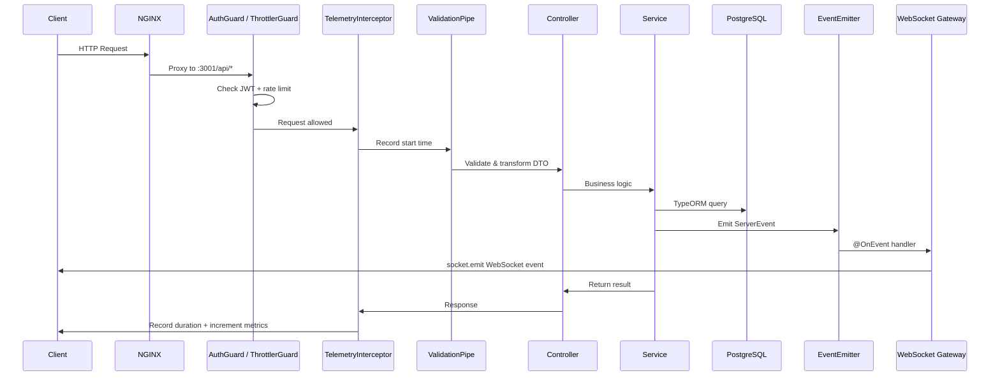

### 7.6 DTO Validation

All request bodies are validated using `class-validator` decorators on DTO classes:

```typescript
export class CreateMessageDto {
  @IsString()
  @MaxLength(4000)
  content: string;
}
```

The global `ValidationPipe` in `main.ts` automatically:
- Validates incoming request bodies against DTO decorators
- Strips unknown properties (`whitelist: true`)
- Transforms plain objects to DTO class instances (`transform: true`)
- Returns 400 Bad Request with specific validation errors

### 7.7 Database Access

TypeORM 0.3.x with PostgreSQL 16. Key patterns:

- **Entities** use UUID primary keys and are defined in `src/utils/typeorm/`
- **BaseMessage** is an abstract class shared by `Message` and `GroupMessage` entities
- **Schema sync:** `synchronize: true` in development auto-creates the schema; migrations are required for production
- **Relationships:** Eagerly loaded where needed to prevent N+1 queries
- **Transactions:** TypeORM's `@Transaction()` decorator or `QueryRunner` for multi-step operations

### 7.8 Logging Strategy

The application uses NestJS's built-in `Logger`:
- Request/response logging via the `TelemetryInterceptor`
- Error logging at the service level
- Bootstrap logging in `main.ts`
- Production: error-level logging only (`logging: ['error']`)

---

## 8. Realtime Architecture Guide

### 8.1 Socket Authentication

WebSocket connections are authenticated at the transport layer during the handshake:

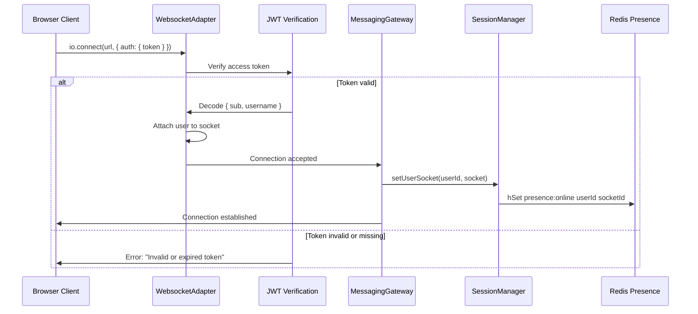

**Authentication details:**
- The token can be sent via `socket.handshake.auth.token` or the `Authorization` header
- JWT verification uses `JWT_SECRET` environment variable
- The decoded user object (`{ id, username }`) is attached to `socket.user`
- Connections without a valid token are rejected immediately — no fallback to unauthenticated mode

### 8.2 Redis Adapter for Multi-Instance Scaling

The `WebsocketAdapter` (`gateway.adapter.ts`) configures Socket.IO with a Redis adapter:

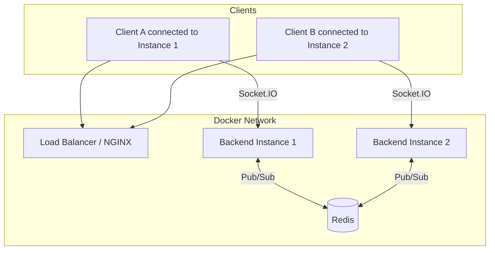

**How it works:**
1. Two Redis clients are created — one for publishing, one for subscribing
2. When a server emits a WebSocket event, the Redis adapter publishes it to a Redis channel
3. All other backend instances subscribed to that channel receive the event and broadcast to their connected clients
4. This ensures a message sent from Instance 1 reaches clients connected to Instance 2

**Fallback behavior:** If Redis is unavailable, the adapter falls back to in-memory mode. A warning is logged: `Failed to apply Redis adapter, falling back to in-memory. Multi-instance scaling will not work.` In this mode, events only reach clients connected to the same backend instance.

### 8.3 Session Management

`GatewaySessionManager` (`gateway.session.ts`) tracks active WebSocket connections:

| Method | Purpose |
|--------|---------|
| `setUserSocket(userId, socket)` | Register a user's socket connection and update Redis presence |
| `removeUserSocket(userId)` | Remove a user's socket and clear Redis presence |
| `getUserSocket(userId)` | Get a specific user's active socket |
| `getSockets()` | Get all active sessions (in-memory map) |
| `setUserOnline(userId, socketId)` | Store online status in Redis hash `presence:online` |
| `setUserOffline(userId, socketId)` | Remove online status (only if socket IDs match — prevents ghost disconnections) |
| `getOnlineUsers()` | Get all online users from Redis or in-memory fallback |
| `isUserOnline(userId)` | Check if a specific user is online |

**Multi-device support:** The session map stores one socket per user (latest connection). If a user opens multiple tabs, the latest socket replaces the previous one. The Redis presence hash uses the user ID as key, mapping to the latest socket ID.

**Ghost user prevention:** When a socket disconnects, the session manager only removes the Redis presence entry if the stored `socketId` matches the disconnecting socket. This prevents a stale disconnect from removing the presence of a newer connection from a different tab.

### 8.4 Room-Based Broadcasting

The gateway manages socket rooms for targeted delivery:

- **Conversation rooms:** When a user opens a conversation, their socket joins a room named after the conversation ID
- **Group rooms:** Similar to conversations, group members' sockets join the group's room
- **Broadcasting:** Events are emitted to specific rooms using `server.to(roomId).emit(event, payload)`, ensuring only relevant clients receive the event

### 8.5 Presence Tracking

Presence uses a Redis hash (`presence:online`) with fallback to in-memory:

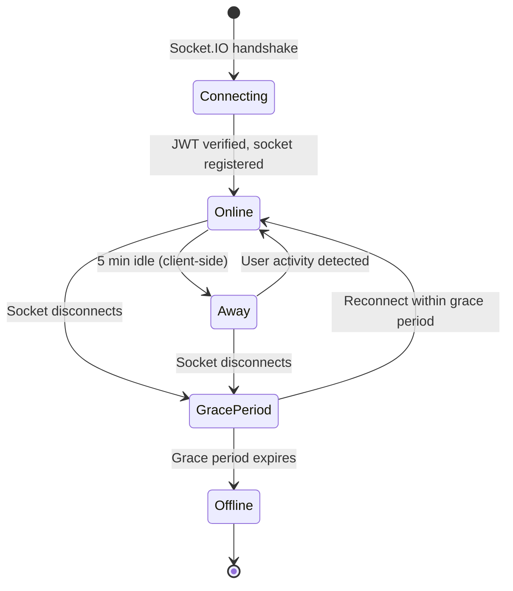

**Consistency across instances:** Since presence is stored in Redis, all backend instances see the same online user set. The `getOnlineUsers()` method queries the Redis hash, providing consistent results regardless of which instance handles the request.

### 8.6 Event Flow: Message Delivery

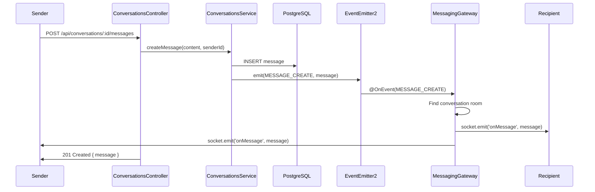

**Key observations:**
- The HTTP response and WebSocket event are independent delivery channels
- The sender receives the message both via the HTTP response (for the REST acknowledgment) and via WebSocket (for real-time UI update)
- The recipient receives the message only via WebSocket
- If the recipient is offline, the message is persisted in PostgreSQL and delivered when they reconnect and fetch conversation messages

### 8.7 Typing Indicators

Typing indicators are ephemeral WebSocket-only events — they are not persisted:

1. The typing user's client emits `typingStart` or `typingStop` with `{ conversationId }`
2. The gateway relays the event to the conversation's room
3. Other participants see "User is typing..." in the UI

**No race condition concerns:** Typing events are purely cosmetic. If events arrive out of order, the worst case is a brief UI flicker.

### 8.8 Reconnection Recovery

When a client disconnects and reconnects:

1. Socket.IO automatically attempts reconnection with exponential backoff
2. On reconnection, the client re-authenticates with its current access token
3. The gateway registers the new socket in the session manager
4. The client fetches missed messages by calling `GET /api/conversations/:id/messages?before=<lastSeenMessageId>`
5. This REST-based recovery ensures no messages are lost, even if WebSocket events were missed during the disconnect

**Limitations of the current implementation:**
- There is no explicit message sequencing or gap detection — the client must track the last seen message ID
- There is no server-side queue of missed events — recovery is entirely client-driven
- Duplicate messages can occur if the client receives a WebSocket event just before disconnecting and then fetches it again via REST

---

## 9. AI Bot Guide

### 9.1 Ollama Integration

The AI bot system integrates with **Ollama**, a local LLM inference engine that runs as a Docker container. This architecture choice provides complete privacy — no user data leaves the Docker network.

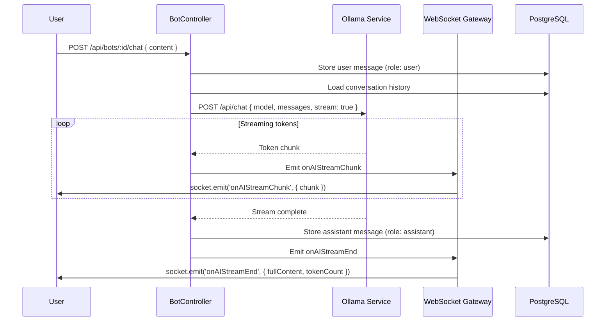

### 9.2 Local LLM Setup

The Ollama container is included in `docker-compose.yml` and starts automatically. To get started:

1. **Start the stack:** `npm run docker:up:d`
2. **Pull a model** (inside the Ollama container):
   ```bash
   docker compose exec ollama ollama pull llama3.2
   ```
3. **Create a bot** via the admin API or let the seed script create a default bot

**Available models** (subject to hardware constraints):
- `llama3.2` — General-purpose assistant (recommended, ~2GB)
- `codellama` — Programming-focused assistant
- `mistral` — Fast, efficient model
- Custom models via Ollama's model library

**Hardware requirements:** LLM inference is CPU/GPU intensive. Without a GPU, responses will be slow (5-30 seconds per response). With GPU passthrough configured in Docker, response times drop to 1-5 seconds.

### 9.3 Persona System

Each bot has a configurable persona that defines its behavior:

| Field | Purpose | Example |
|-------|---------|---------|
| `name` | Display name in the conversation sidebar | "ChatBot", "Code Helper" |
| `persona` | Short description shown in the bot list | "A helpful and friendly assistant" |
| `model` | Ollama model identifier | `llama3.2`, `codellama` |
| `systemPrompt` | Full system prompt injected before conversation history | "You are an expert programmer who explains concepts clearly..." |

The system prompt is sent as the first message in every LLM call with `role: "system"`, followed by the conversation history with `role: "user"` and `role: "assistant"` entries.

### 9.4 Streaming Response Design

Bot responses are streamed token-by-token via WebSocket for immediate user feedback:

**Events:**
- `onAIStreamChunk` — Each token as it's generated: `{ conversationId, chunk }`
- `onAIStreamEnd` — Generation complete: `{ conversationId, messageId, fullContent, tokenCount }`
- `onAIStreamError` — Generation failed: `{ conversationId, error }`

**Error handling:**
- If Ollama is unavailable (503), the user receives an error message
- If the stream fails mid-generation, `onAIStreamError` is emitted with the error details
- Partial responses are not stored — only complete responses are persisted to the database

### 9.5 Context Retrieval

Each bot maintains a separate conversation per user. Context retrieval works as follows:

1. When a user sends a message, the backend loads the full conversation history from PostgreSQL
2. The history is formatted as an array of `{ role, content }` messages
3. The system prompt is prepended to the history
4. The complete message array is sent to Ollama's chat API

**Token budgeting:** The current implementation does not enforce a token limit. Long conversations may exceed the model's context window, causing Ollama to truncate early messages. Future enhancements should implement:
- Sliding window context (keep last N messages)
- Token counting and budget allocation
- Summary-based context compression

### 9.6 Cost, Latency, and Privacy Tradeoffs

| Factor | Ollama (Local) | OpenAI / Hosted APIs |
|--------|---------------|---------------------|
| **Cost** | Free (hardware costs only) | Per-token pricing ($0.01-0.06/1K tokens) |
| **Privacy** | Complete — data never leaves the network | User data sent to third-party servers |
| **Latency** | 1-30s (depends on hardware) | 0.5-3s (optimized inference) |
| **Quality** | Depends on model (7B-70B params) | GPT-4 class models available |
| **Setup** | Requires GPU for acceptable speed | API key only |
| **Offline** | Works without internet | Requires internet connectivity |

**Recommendation:** Use Ollama for privacy-sensitive deployments and development. Consider hosted APIs for production deployments requiring higher quality or lower latency.

---

## 10. DevOps & Deployment Guide

### 10.1 Docker Compose Architecture

The platform runs as 9 Docker containers orchestrated by Docker Compose:

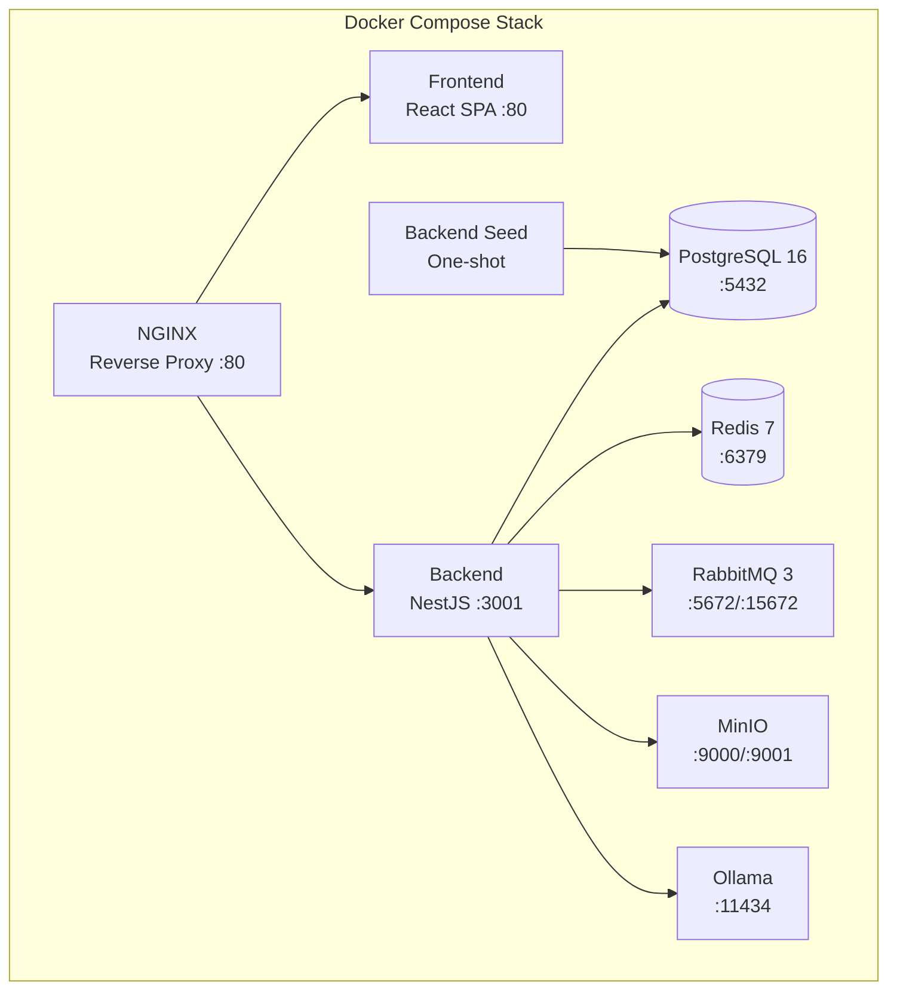

**Startup order and health checks:**
1. PostgreSQL, Redis, RabbitMQ, MinIO start first with native health checks
2. Backend waits for all infrastructure services to be `healthy` (via `depends_on: condition: service_healthy`)
3. Backend seed runs after the backend is healthy
4. Frontend starts after the backend is healthy
5. NGINX starts last, proxying to both frontend and backend

**Volumes:** Six persistent volumes ensure data survives container restarts: `postgres_data`, `redis_data`, `minio_data`, `rabbitmq_data`, `backend_uploads`, `ollama_data`.

### 10.2 Docker Builds

Both the backend and frontend use **multi-stage Dockerfiles** optimized for different environments:

**Backend (`docker/backend.Dockerfile`):**

| Stage | Base | Purpose |
|-------|------|---------|
| `development` | `oven/bun:1` | Hot-reload dev server with source mount |
| `build` | `oven/bun:1` | SWC compilation (`bun run build`) |
| `production` | `oven/bun:1` | Production dependencies + compiled output |

**Frontend (`docker/frontend.Dockerfile`):**

| Stage | Base | Purpose |
|-------|------|---------|
| `development` | `oven/bun:1` | Vite dev server with source mount |
| `build` | `oven/bun:1` | Production build (`bun run build`) |
| `production` | `nginx:1.27-alpine` | Static file serving with client-side routing |

The frontend production stage embeds an NGINX config with `try_files $uri $uri/ /index.html` for SPA routing and long-term caching for `/assets/`.

### 10.3 NGINX Reverse Proxy

The NGINX configuration (`docker/nginx/nginx.conf`) handles three routing concerns:

| Location | Upstream | Notes |
|----------|----------|-------|
| `/api/` | `backend:3001` | REST API with WebSocket upgrade headers |
| `/socket.io/` | `backend:3001` | Socket.IO WebSocket connections |
| `/` | `frontend:3000` | Frontend SPA |

**WebSocket configuration:**
- `proxy_http_version 1.1` and `Upgrade`/`Connection` headers enable WebSocket proxying
- `proxy_read_timeout 86400s` (24 hours) prevents long-lived WebSocket connections from being terminated
- `client_max_body_size 50M` allows large file uploads
- `X-Real-IP` and `X-Forwarded-For` headers pass the real client IP to the backend

### 10.4 CI/CD Pipeline

The GitHub Actions pipeline (`.github/workflows/ci.yml`) runs on every push to `main`/`develop` and on PRs to `main`:

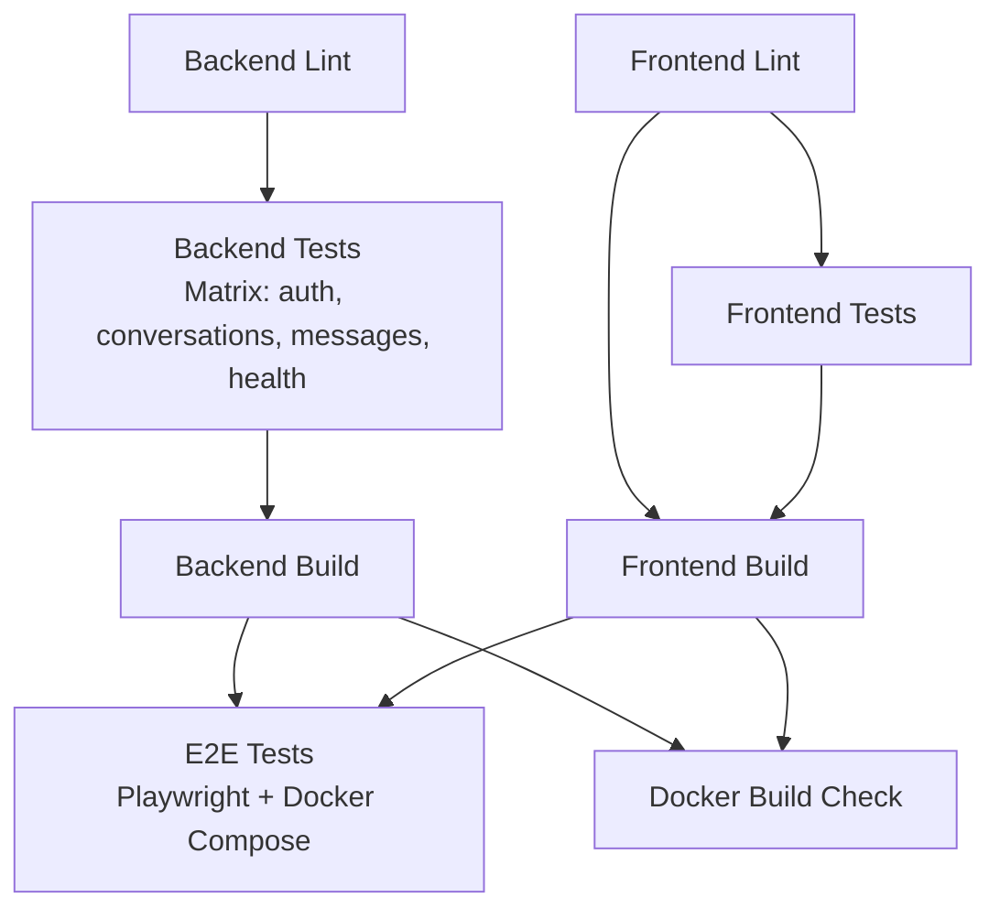

**Pipeline stages:**

| Job | Runner | Services | Purpose |
|-----|--------|----------|---------|
| `backend-lint` | ubuntu-latest | — | ESLint check |
| `backend-test` | ubuntu-latest | PostgreSQL 16 + Redis 7 | Jest unit tests (4 matrix shards) |
| `backend-build` | ubuntu-latest | — | SWC compilation |
| `frontend-lint` | ubuntu-latest | — | ESLint check |
| `frontend-test` | ubuntu-latest | — | Vitest unit tests |
| `frontend-build` | ubuntu-latest | — | Vite production build |
| `e2e-tests` | ubuntu-latest | Full Docker stack | Playwright E2E (4 workers) |
| `docker-build` | ubuntu-latest | — | Smoke test Docker image builds |

All jobs use **Bun** runtime via `oven-sh/setup-bun@v2`.

### 10.5 Deployment

**Frontend deployment:** Configured for Vercel via `vercel.json` at the repository root. The Vite production build outputs to `dist/`, which Vercel serves as a static site.

**Backend deployment:** Via Docker. The backend container can be deployed to any Docker-compatible host:
- Single-server: Docker Compose on a VPS
- Container orchestration: AWS ECS, Google Cloud Run, or Kubernetes
- The health endpoint (`/api/health`) enables load balancer health checks

### 10.6 Horizontal Scaling Strategy

To scale the backend horizontally:

1. **Run multiple backend containers** behind a load balancer
2. **Enable the Redis adapter** for Socket.IO (already configured) — this synchronizes WebSocket events across instances
3. **Configure sticky sessions** at the load balancer level (recommended but not required with the Redis adapter)
4. **Scale RabbitMQ consumers** independently — each backend instance runs its own consumer, increasing throughput
5. **PostgreSQL** supports read replicas for read-heavy workloads

**Limitations:**
- The session manager stores one socket per user in memory — with multiple instances, the in-memory map only contains sockets connected to that instance. The Redis adapter handles cross-instance delivery.
- File uploads go through MinIO (already stateless) — no sticky sessions needed for uploads.

### 10.7 Kubernetes Migration Path

The Docker Compose stack maps directly to Kubernetes resources:

| Docker Compose | Kubernetes |
|---------------|------------|
| Service | Deployment + Service |
| Volume | PersistentVolumeClaim |
| Environment variables | ConfigMap + Secrets |
| Health checks | Liveness + Readiness probes |
| NGINX reverse proxy | Ingress controller |
| Docker network | Service mesh / CNI |

**Migration steps:**
1. Create Docker registry and push images
2. Define Kubernetes manifests (Deployments, Services, PVCs)
3. Create ConfigMaps from `.env.docker` and Secrets for sensitive values
4. Add Ingress resource replacing the NGINX container
5. Configure horizontal pod autoscaling for the backend deployment
6. Set up managed PostgreSQL, Redis, and RabbitMQ (or run as StatefulSets)

---

## 11. Monitoring & Operations Guide

### 11.1 Monitoring Stack Overview

The monitoring stack consists of four services, started via `docker-compose.monitoring.yml`:

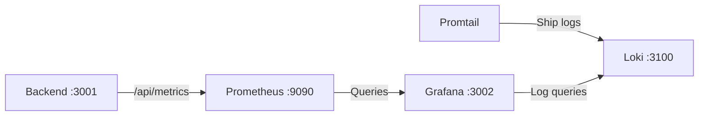

| Service | Image | Port | Purpose |
|---------|-------|------|---------|
| Prometheus | `prom/prometheus:latest` | 9090 | Metrics scraping and time-series storage |
| Grafana | `grafana/grafana:latest` | 3002 | Dashboards, alerting, log exploration |
| Loki | `grafana/loki:latest` | 3100 | Log aggregation (Promtail ships logs here) |
| Promtail | `grafana/promtail:latest` | — | Log shipper — reads Docker container logs and forwards to Loki |

### 11.2 Prometheus Metrics

The backend exposes a custom Prometheus-format metrics endpoint at `GET /api/metrics`. The `TelemetryService` is a custom implementation (not the OpenTelemetry SDK) that maintains in-memory counters, gauges, and histograms and serializes them to Prometheus exposition format.

**Collected metrics:**

| Metric | Type | Labels | Description |
|--------|------|--------|-------------|
| `http_requests_total` | Counter | `method`, `route`, `status_code` | Total HTTP requests processed |
| `http_request_duration_seconds` | Histogram | `method`, `route`, `status_code` | Request duration in seconds |

**Histogram buckets:** 0.005s, 0.01s, 0.025s, 0.05s, 0.1s, 0.25s, 0.5s, 1s, 2.5s, 5s, 10s

**Scrape configuration** (`docker/prometheus/prometheus.yml`):
- Target: `backend:3001` (Docker service name)
- Interval: 15 seconds
- Path: `/api/metrics`

### 11.3 Grafana Dashboards

Grafana is pre-configured with:
- **Datasources:** Prometheus (metrics) and Loki (logs), auto-provisioned from `docker/grafana/provisioning/datasources/`
- **Dashboard:** A pre-built "ChatApp Overview" dashboard (`docker/grafana/provisioning/dashboards/json/chatapp-overview.json`) with panels for:
  - Request rate (requests/second by route)
  - Response latency (p50, p95, p99 from histogram)
  - Error rate (4xx and 5xx status codes)
  - CPU and memory (if node exporter is added)

**Access:** `http://localhost:3002` with credentials from `.env.docker` (default: `admin`/`admin`).

### 11.4 Log Aggregation

**Promtail** ships container logs to **Loki**:
- Reads from Docker container stdout/stderr via the Docker socket
- Labels logs with container name, service, and source
- Loki stores logs with compression and indexing by labels

**Querying logs in Grafana:**
- Navigate to **Explore** in Grafana
- Select **Loki** as the data source
- Use LogQL queries:
  ```
  {container_name="chatapp-backend"} |= "error"
  {container_name="chatapp-backend"} | json | line_format "{{.message}}"
  ```

### 11.5 Health Checks

All infrastructure services have native Docker health checks:

| Service | Check | Interval |
|---------|-------|----------|
| PostgreSQL | `pg_isready -U chatapp` | 10s |
| Redis | `redis-cli ping` | 10s |
| RabbitMQ | `rabbitmq-diagnostics -q ping` | 15s |
| MinIO | `curl -f http://localhost:9000/minio/health/live` | 10s |
| Backend | `fetch('http://localhost:3001/api/health')` | 15s |
| NGINX | `wget -qO /dev/null http://127.0.0.1:80/` | 15s |

**Backend health endpoint** (`GET /api/health`):
```json
{
  "status": "ok",
  "services": {
    "postgresql": "up",
    "redis": "up"
  },
  "timestamp": "2025-06-10T14:30:00.000Z"
}
```

- `status` is `"ok"` when all services are up, `"degraded"` when any is down
- PostgreSQL: verifies `connection.isConnected` and runs `SELECT 1`
- Redis: calls `redisService.ping()` and checks for `PONG`

### 11.6 Alerting Strategy

Grafana supports alerting rules that can notify via email, Slack, PagerDuty, and webhooks. Recommended alerts:

| Alert | Condition | Severity |
|-------|-----------|----------|
| High Error Rate | `http_requests_total{status_code=~"5.."}` rate > 5% over 5m | Critical |
| High Latency | `http_request_duration_seconds` p99 > 2s over 5m | Warning |
| Backend Down | Health check returns non-200 for 3 consecutive checks | Critical |
| Database Connection Lost | Health endpoint returns `"degraded"` | Critical |
| Redis Unavailable | Health endpoint shows Redis `"down"` | Critical |

### 11.7 SLO/SLA Considerations

For production deployments, define Service Level Objectives:

| SLO | Target | Measurement |
|-----|--------|-------------|
| API Availability | 99.9% | Successful health checks / total checks |
| Message Delivery Latency | p99 < 500ms | Time from POST to WebSocket delivery |
| WebSocket Connection Reliability | 99.5% | Successful connects / total attempts |
| File Upload Success Rate | 99% | Completed uploads / initiated uploads |

---

## 12. Security & Compliance Guide

### 12.1 JWT Security

The platform uses a dual-token JWT authentication strategy:

| Token | Lifetime | Storage | Secret |
|-------|----------|---------|--------|
| Access Token | 15 minutes | Client memory (Redux store) | `JWT_SECRET` |
| Refresh Token | 7 days | HTTP-only cookie + database (SHA-256 hash) | `JWT_REFRESH_SECRET` |

**Why separate secrets?** Access and refresh tokens use independent signing secrets. If an access token secret is compromised, refresh tokens remain valid, allowing controlled token rotation without full session invalidation.

**Refresh token rotation:** On every refresh, the old token is revoked and a new token pair is issued. This limits the window of opportunity if a refresh token is stolen — the attacker gets at most one use before the legitimate user's next refresh invalidates it.

**Stateless access tokens:** Access tokens are validated by signature only — no database lookup per request. This maximizes performance but means access tokens cannot be individually revoked before their 15-minute expiry. The short lifetime is the primary mitigation.

**Token storage:**
- Refresh tokens are stored in PostgreSQL as **SHA-256 hashes**, never in plaintext
- The plaintext refresh token is returned to the client only once (on login/refresh)
- An HTTP-only cookie transports the refresh token, preventing JavaScript access (XSS protection)

### 12.2 CSRF/XSS Mitigation

| Threat | Mitigation |
|--------|-----------|
| **Cross-Site Scripting (XSS)** | Access tokens stored in memory (not localStorage). HTTP-only cookies for refresh tokens. React's built-in JSX escaping prevents reflected XSS. Content-Security-Policy headers recommended for production |
| **Cross-Site Request Forgery (CSRF)** | API uses Bearer token authentication (not cookie-based for API requests). The refresh cookie is only used for the `/auth/refresh` endpoint. CORS is configured with explicit allowed origins |
| **Clickjacking** | `X-Frame-Options` and `Content-Security-Policy: frame-ancestors` headers recommended in production NGINX config (not yet configured) |

### 12.3 SQL Injection Prevention

All database queries use TypeORM's query builder with parameterized queries:

```typescript
// Parameterized — safe from SQL injection
createQueryBuilder('audit_log')
  .where('audit_log.userId = :userId', { userId })
  .andWhere('audit_log.action = :action', { action })
```

Raw SQL queries are not used anywhere in the codebase. TypeORM's entity manager and repository patterns enforce parameterization.

### 12.4 OWASP Top 10 Mitigation

| OWASP Category | Status | Mitigation |
|---------------|--------|-----------|
| A01 - Broken Access Control | Implemented | Role-based guards (`UserRole`), `@UseGuards(AdminGuard)` on admin endpoints, JWT-based authentication |
| A02 - Cryptographic Failures | Implemented | bcrypt password hashing, HTTPS recommended for production, HTTP-only cookies |
| A03 - Injection | Implemented | TypeORM parameterized queries, `class-validator` input validation, `ValidationPipe` with `whitelist: true` |
| A04 - Insecure Design | Partial | Modular architecture with clear boundaries, but some gaps (no family-based refresh token detection) |
| A05 - Security Misconfiguration | Partial | Default credentials in `.env.docker` (tracked), `synchronize: true` in dev, Swagger enabled in all environments |
| A06 - Vulnerable Components | Mitigated | Bun runtime for faster security patches, `yarn audit` should be run regularly |
| A07 - Auth Failures | Implemented | Rate limiting (10 req/10s), bcrypt password hashing, account lockout via ban system |
| A08 - Software/Data Integrity | Implemented | Refresh token rotation, SHA-256 hashed token storage |
| A09 - Logging/Monitoring | Implemented | Audit logging for admin actions, Prometheus metrics, Loki log aggregation |
| A10 - SSRF | Low risk | No user-controlled URL fetching in the current implementation |

### 12.5 Rate Limiting

Global rate limiting via NestJS ThrottlerModule:
- **Limit:** 10 requests per 10-second window per client IP
- **Proxy-aware:** Extracts real client IP from `X-Forwarded-For` header (first entry), with fallback to `req.ip`
- **Trust proxy:** Backend sets `app.set('trust proxy', 'loopback')` to trust the NGINX proxy

**Production recommendation:** Consider per-endpoint rate limiting — stricter for auth endpoints (e.g., 5 req/min for login), more lenient for read endpoints (e.g., 100 req/min for message listing).

### 12.6 Encryption

| Layer | Mechanism |
|-------|-----------|
| **In transit** | TLS termination at NGINX (configure SSL certificates for production). Backend-to-service traffic within Docker network is unencrypted (acceptable for single-host deployment) |
| **At rest** | PostgreSQL supports encryption at rest via TDE (Transparent Data Encryption) or disk-level encryption. MinIO supports server-side encryption. Redis persistence files should be on encrypted volumes |
| **Passwords** | bcrypt with default cost factor (10 rounds) |
| **Refresh tokens** | SHA-256 hashed before database storage |

### 12.7 Audit Logging

All admin write operations are automatically logged by the audit processor (RabbitMQ consumer):

| Field | Description |
|-------|-------------|
| `userId` | The admin who performed the action |
| `action` | `CREATE`, `UPDATE`, or `DELETE` |
| `entity` | Entity type (User, Message, Group, etc.) |
| `entityId` | UUID/ID of the affected entity |
| `metadata` | JSONB with additional context (e.g., previous values, reason) |
| `ipAddress` | Source IP address of the request |
| `createdAt` | Timestamp |

**Properties:**
- Append-only — no API to modify or delete audit entries
- Filterable by userId, action, entity, and date range
- Paginated (default 20 entries per page)
- Uses parameterized queries (SQL injection safe)

### 12.8 Compliance

#### GDPR Considerations

| Requirement | Implementation Status |
|-------------|----------------------|
| **Right to access** | Users can view their profile via `GET /api/auth/me` |
| **Right to rectification** | Users can update profile via `PATCH /api/users/profiles` |
| **Right to erasure** | Not implemented — requires a data deletion workflow that removes user data from PostgreSQL, MinIO, and Redis |
| **Data portability** | Not implemented — requires an export endpoint returning user data in machine-readable format |
| **Consent management** | Not implemented — no consent tracking or cookie consent banner |
| **Data retention** | Notifications auto-deleted after 90 days. No retention policies for messages or audit logs |
| **Data Processing Agreement** | Not applicable for self-hosted deployment |

#### Right to Be Forgotten (Future Implementation)

A complete right-to-be-forgotten workflow would need to:
1. Delete or anonymize the user's profile (username, email, avatar, banner)
2. Delete or anonymize the user's messages (replace content with "[deleted]", preserve for conversation integrity)
3. Remove the user from friends lists and group memberships
4. Delete file attachments uploaded by the user
5. Remove Redis presence and cached data
6. Retain audit logs with anonymized userId (legal requirement in many jurisdictions)

### 12.9 Secrets Management

**Current state:** Secrets are stored in `.env.docker` and tracked in git with weak default values. This is acceptable for local development but **must not** be used in production.

**Production recommendations:**
- Use a secrets manager (HashiCorp Vault, AWS Secrets Manager, Doppler)
- Generate cryptographically random secrets (minimum 32 bytes): `openssl rand -hex 32`
- Never commit secrets to version control
- Rotate secrets periodically and after any suspected compromise
- Use separate secrets per environment (dev, staging, prod)
- Minimize the number of people with access to production secrets

---

## 13. Troubleshooting Guide

### 13.1 Docker Issues

**Backend won't start:**
```bash
# Check if all infrastructure services are healthy
docker compose ps

# Expected: postgres, redis, rabbitmq, minio all show "healthy"
# If any show "starting", wait or check logs:
docker compose logs postgres
docker compose logs redis
```

**Port already in use:**
```bash
# Change the port in .env.docker
NGINX_HTTP_PORT=8080
BACKEND_PORT=3002

# Then restart
npm run docker:down
npm run docker:up:d
```

**Frontend shows blank page:**
- Verify the backend is running: `curl http://localhost/api/health`
- Check that `VITE_API_URL` and `VITE_WEBSOCKET_URL` in `.env.docker` point to the correct backend
- Clear browser cache and hard-refresh

**Reset everything:**
```bash
npm run docker:down:volumes
npm run docker:up:d
```

### 13.2 Redis Connection Failures

**Symptoms:** Backend logs show Redis connection errors, WebSocket events not broadcasting, token blacklisting not working.

**Diagnosis:**
```bash
# Check Redis health
docker compose exec redis redis-cli ping
# Expected: PONG

# Check Redis connectivity from backend
docker compose exec backend bun -e "const r = new (require('ioredis'))({host:'redis',port:6379}); r.ping().then(console.log).catch(console.error)"
```

**Common causes:**
- Redis container not started or not healthy
- Wrong `REDIS_HOST` or `REDIS_PORT` in environment
- Memory pressure causing Redis to refuse connections

**Resolution:**
```bash
docker compose restart redis
# Wait for health check to pass, then restart backend
docker compose restart backend
```

### 13.3 WebSocket Failures

**Symptoms:** Messages not appearing in real-time, presence not updating, typing indicators not working.

**Diagnosis:**
```bash
# Check backend health
curl http://localhost/api/health

# Check NGINX WebSocket proxy
# Look for "Connection: upgrade" headers
curl -v -H "Upgrade: websocket" -H "Connection: Upgrade" http://localhost/socket.io/
```

**Common causes:**
- NGINX not proxying WebSocket upgrade headers (verify `nginx.conf` has the upgrade headers)
- Redis adapter not connecting (check backend logs for "Failed to apply Redis adapter")
- Access token expired (client must reconnect with fresh token)

### 13.4 Queue Backlog Issues

**Symptoms:** Notifications not delivered, audit logs not recorded, file uploads not processed.

**Diagnosis:**
```bash
# Check RabbitMQ management UI
# Open http://localhost:15672 (default: chatapp/chatapp_secret)

# Check queue depths in the management UI
# Look for: file-upload, notification, audit queues
# If any show growing message counts without consumption, consumers are stuck
```

**Common causes:**
- Backend consumer crashed (restart backend)
- Dead-letter queue full (check `.dlq` queues)
- RabbitMQ disk or memory alarm (check management UI overview)

**Resolution:**
```bash
docker compose restart backend
# If queues are stuck, purge and restart:
# Use RabbitMQ management UI to purge specific queues
```

### 13.5 Database Performance Issues

**Symptoms:** Slow API responses, timeouts on message queries.

**Diagnosis:**
```bash
# Check PostgreSQL connections
docker compose exec postgres psql -U chatapp -c "SELECT count(*) FROM pg_stat_activity;"

# Check active queries
docker compose exec postgres psql -U chatapp -c "SELECT pid, now() - pg_stat_activity.query_start AS duration, query FROM pg_stat_activity WHERE (now() - pg_stat_activity.query_start) > interval '5 seconds';"
```

**Common causes:**
- Missing indexes on frequently queried columns (should have indexes on `userId`, `conversationId`, `createdAt`)
- N+1 queries from TypeORM eager loading (check for excessive JOINs)
- Connection pool exhaustion (TypeORM default pool size may need increasing)

### 13.6 AI Inference Failures

**Symptoms:** Bot returns 503, no streaming response, timeouts.

**Diagnosis:**
```bash
# Check Ollama container
docker compose logs ollama

# Test Ollama directly
curl http://localhost:11434/api/tags
# Should return list of available models

# If no models are pulled:
docker compose exec ollama ollama pull llama3.2
```

**Common causes:**
- No model pulled (first-time setup)
- Insufficient memory for model loading (llama3.2 requires ~2GB RAM)
- Ollama container crashed (check `docker compose ps`)

---

## 14. Production Operations Checklist

### 14.1 Pre-Production Checklist

- [ ] Change all default credentials in `.env.docker` (database, Redis, RabbitMQ, MinIO, JWT secrets, superuser)
- [ ] Generate cryptographically random JWT secrets (`openssl rand -hex 32`)
- [ ] Set `ENVIRONMENT=PRODUCTION` to disable `synchronize: true` and enable production logging
- [ ] Configure TLS certificates for NGINX (HTTPS)
- [ ] Set `CORS_ORIGIN` to exact frontend domain(s) — never use `*`
- [ ] Set `MINIO_USE_SSL=true` if using managed S3
- [ ] Configure database SSL (`DATABASE_SSL=true`)
- [ ] Run database migrations (`yarn migration:run`)
- [ ] Disable Swagger docs in production or restrict access
- [ ] Review and tighten rate limiting thresholds for production traffic

### 14.2 Security Checklist

- [ ] All secrets are in a secrets manager (not in `.env` files or git)
- [ ] JWT access token lifetime is 15 minutes or less
- [ ] Refresh token lifetime is appropriate for the use case
- [ ] HTTP-only cookies are configured with `Secure` and `SameSite` flags
- [ ] Rate limiting is configured and tested
- [ ] Admin panel is restricted to authorized IP ranges (recommended)
- [ ] Audit logging is enabled and capturing all admin actions
- [ ] Default superuser password has been changed
- [ ] Unnecessary services are not exposed to the public internet
- [ ] Regular dependency audits are scheduled (`yarn audit` / `bun audit`)

### 14.3 Performance Checklist

- [ ] PostgreSQL has appropriate indexes on `userId`, `conversationId`, `createdAt`, and search columns
- [ ] Redis is configured with appropriate `maxmemory` and eviction policy
- [ ] MinIO buckets have lifecycle policies for old uploads
- [ ] NGINX `client_max_body_size` matches the application's upload limit
- [ ] Connection pool sizes are configured for production load
- [ ] TypeORM eager loading is reviewed for N+1 query risks

### 14.4 Observability Checklist

- [ ] Prometheus is scraping `/api/metrics` every 15 seconds
- [ ] Grafana dashboards are provisioned and accessible
- [ ] Loki is receiving logs from Promtail
- [ ] Alerting rules are configured (high error rate, high latency, service down)
- [ ] Health check endpoint is monitored by an external service (UptimeRobot, Pingdom)
- [ ] Log retention policies are configured (Loki retention, Prometheus retention)

### 14.5 Backup Checklist

- [ ] PostgreSQL backups are scheduled (daily recommended): `pg_dump` or managed backup service
- [ ] MinIO data is backed up or replicated
- [ ] Redis persistence is configured (AOF or RDB) if cached data must survive restarts
- [ ] Backup restoration has been tested
- [ ] Backup encryption is enabled for off-site storage

### 14.6 Disaster Recovery Checklist

- [ ] Recovery Time Objective (RTO) is defined
- [ ] Recovery Point Objective (RPO) is defined
- [ ] Database restore procedure is documented and tested
- [ ] Container images are stored in a container registry (not built on-the-fly)
- [ ] Environment variable backups are stored securely
- [ ] A runbook exists for common failure scenarios (see [Section 13: Troubleshooting Guide](#13-troubleshooting-guide))

### 14.7 Deployment Checklist

- [ ] CI pipeline passes (lint, test, build, E2E)
- [ ] Database migrations are run before deploying new backend
- [ ] Container images are built and tagged with version/commit
- [ ] Rolling deployment strategy is used (or blue/green for zero downtime)
- [ ] Health checks pass after deployment
- [ ] Smoke tests are run against the production environment
- [ ] Monitoring dashboards are checked for anomalies post-deployment
- [ ] Rollback plan is documented and tested

---

